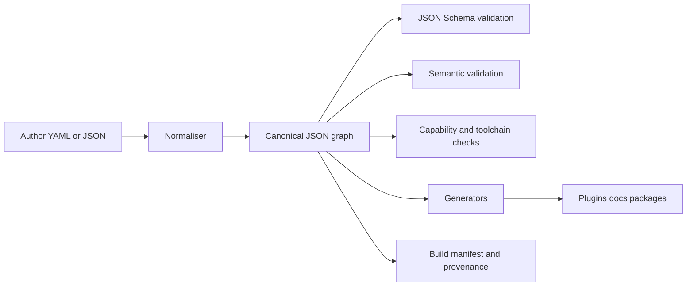

# R004 WastelandForge Contract, Schema and Registry Design

## Executive conclusion

The strongest recommendation from this research is to make **version-controlled YAML or JSON source documents** the only canonical truth in WastelandForge, to **normalise them into canonical JSON internally**, and to validate that canonical JSON with **JSON Schema Draft 2020-12** plus a second layer of **deterministic semantic validation**. That gives Forge a contract system that is human-authorable, machine-checkable, generator-friendly, and decoupled from GECK sessions, game saves, plugin binaries, or AI tooling. YAML remains attractive for author ergonomics because it is a human-readable superset of JSON, while JSON remains the natural target for JSON Schema and .NET validation libraries. Draft 2020-12 is the best canonical schema dialect because it is the current general-use meta-schema, adds formal output schemas and better bundling guidance, and is well supported by modern .NET validators such as JsonSchema.Net. The main caveat is editor tooling: VS Code’s built-in JSON tooling only has limited support for 2019-09 and 2020-12, and the Red Hat YAML extension ships with Draft 7 support, so Forge should treat **2020-12 as canonical** while shipping **editor-compatibility Draft 7 mirrors or a schema-association extension** for author UX. citeturn11view0turn14view1turn14view0turn27view3turn27view2turn4view2

On the .NET side, the best v0.1 stack is **System.Text.Json** for canonical JSON and DOM work, **YamlDotNet** for YAML ingestion, and **JsonSchema.Net** for runtime schema validation. System.Text.Json is in the .NET runtime, is explicitly documented as prioritising performance, security, and standards compliance, and offers both a read-only DOM (`JsonDocument`) and a mutable DOM (`JsonNode`). YamlDotNet provides low-level parsing/emitting plus a higher-level object model and serializer for YAML. JsonSchema.Net supports drafts 6, 7, 2019-09, and 2020-12, documents standardised evaluation output with instance and schema locations, and is listed by json-schema.org as a .NET implementation with MIT licensing and 2020-12 support. By contrast, Json.NET Schema is feature-rich but carries AGPL/commercial licensing constraints, and NJsonSchema, while useful for code generation, still shows open 2020-12 friction in its issue tracker. Corvus.JsonSchema is promising for later schema-to-code generation, but its centre of gravity is source generation and strongly-typed code rather than the smallest possible runtime-validation spine for Forge v0.1. citeturn16view2turn16view1turn4view1turn4view2turn28view5turn28view3turn28view4turn24search1turn27view0turn27view1turn32view0

The recommended v0.1 registry surface is deliberately small. The **manifest** is mandatory, while the first logical registries should be **dependency**, **capability**, and **asset**; quest, dialogue, faction, and reputation event registries should follow once the contract layer is stable. Logical IDs should be **stable dotted lowercase identifiers** owned by the project, with reverse-DNS preferred but not mandatory; game FormIDs should remain implementation references, not primary identity. Diagnostic output should use **JSON Pointer-based locations**, stable rule IDs, and first-class console, JSON, and SARIF output. Every generated artefact should carry provenance, at minimum through a local `build-manifest.json`; release-grade provenance can later add GitHub attestations or SLSA-style metadata. Finally, the platform should adopt a hard rule that **AI is optional**: no required API keys, no required cloud services, and no canonical project state that depends on an LLM response. citeturn15search2turn15search5turn31search18turn14view4turn9search3turn25view1turn25view2turn25view3turn25view4

| Decision area | Recommendation |
|---|---|
| Author input | YAML or JSON |
| Internal canonical form | Canonical JSON |
| Schema dialect | JSON Schema Draft 2020-12 canonical, with editor-compatibility strategy |
| Runtime validator | JsonSchema.Net |
| Canonical v0.1 registries | Manifest, dependency, capability, asset |
| Primary IDs | Stable dotted logical IDs |
| External implementation refs | Plugin name, Editor ID, FormID, provider refs |
| Validation outputs | Console, JSON, SARIF |
| Provenance | Build manifest always, optional attestation later |
| AI policy | Optional, never canonical |



## Contract format recommendation

The best authoring model is a **hybrid format policy**: authors may write either YAML or JSON, but Forge should normalise everything into **canonical JSON** before any validation, indexing, generation, or diffing. That recommendation follows directly from the underlying standards. YAML 1.2 is explicitly positioned as more human-readable than JSON and is a superset of JSON, while JSON Schema is a JSON vocabulary for describing and validating JSON instances. In practical terms, that means YAML gives authors readable files and comments, while canonical JSON gives Forge a uniform internal substrate for schema validation, semantic validation, source hashing, provenance, and deterministic generators. System.Text.Json’s mutable `JsonNode` DOM is the most natural internal representation for that canonical JSON layer. citeturn11view0turn14view1turn16view1turn16view2

That said, Forge should not accept “full YAML” in the abstract. YAML supports graph aliasing, application-defined tags, and streaming/multi-document patterns, and the specification explicitly treats a number of formatting concerns as presentation details rather than semantic content. Those features are powerful, but they are exactly the kind of hidden indirection that makes deterministic build pipelines harder to reason about. For WastelandForge v0.1, the right move is to support a **safe YAML subset** that maps cleanly to JSON: mappings, sequences, scalar values, and comments. Forge should reject or forbid anchors, aliases, custom tags, merge-key style indirection, and multi-document streams in canonical source contracts. That keeps the source model explicit, easier to diff, and easier to normalise. YAML also requires unique mapping keys, which aligns well with Forge’s need for stable, unambiguous source semantics. citeturn11view0

Comments deserve a separate design rule. YAML comments are useful for authors, but the YAML specification treats comments and related presentation concerns as non-semantic, and YamlDotNet’s own issue history shows that comment-preserving round trips are not a reliable assumption for normal object-model editing. Forge therefore should **allow comments in source**, but it should **not promise comment-preserving rewrites** except in explicit formatting or migration commands designed for that purpose. The core validator and generator pipeline should be read-only with respect to source files. In other words: `forge validate` must not rewrite contracts; `forge fmt` and `forge migrate` may, but only as an explicit opt-in action. citeturn11view0turn12view0

JSON input should be accepted on equal footing with YAML, especially for automation, fixtures, tests, generated contracts, and teams that prefer strict machine-oriented authoring. Forge may also choose to accept author-friendly JSON comments and trailing commas at ingest time, because System.Text.Json can be configured to skip comments and allow trailing commas, but the **canonical normalised JSON** that Forge persists in caches, hashes, or provenance should always be strict JSON without comments. That gives authors a little convenience without allowing ambiguity into the canonical layer. citeturn16view0turn16view2

A good v0.1 file policy is:

```text
wastelandforge.yaml          # preferred root manifest
wastelandforge.json          # equivalent strict JSON form

registries/
  dependencies/
  capabilities/
  assets/
  quests/
  dialogue/
```

The key design rule is that the **logical registry** matters more than the **physical shape**. Small registries may be authored as one file; larger registries should be authored as directories of documents. Forge should normalise both layouts into the same internal canonical graph. That keeps the CLI simple while allowing projects to scale without giant merge-conflict-heavy files.

## Schema dialect and .NET implementation

The canonical schema dialect should be **JSON Schema Draft 2020-12**. The reasons are practical, not fashionable. Draft 2020-12 is the latest general-use meta-schema published by json-schema.org; it formalises improvements around arrays and tuples, dynamic references, bundling of embedded schemas into compound schema documents, and output schemas for validation results. Its annotation vocabulary is also mature enough to treat schemas as both validation artefacts and documentation sources, which matters for Forge because schema files are going to be part of the public API of the platform, not just internal enforcement machinery. citeturn14view1turn14view0turn14view3turn14view4

The most important caution is tooling compatibility, not specification quality. VS Code’s built-in JSON support documents full support from Draft 4 to Draft 7 and only **limited support** for 2019-09 and 2020-12. The Red Hat YAML extension, which is the de facto YAML language layer many authors use, states that its schema support ships with **JSON Schema Draft 7**. That means a Forge schema strategy that leans too hard on 2020-12-only features will degrade completion and inline feedback for a large share of authors. The cleanest response is not to fall back to Draft 7 as the canonical authority; it is to keep 2020-12 as canonical while using an **editor-safe subset** for v0.1 and, where necessary, generating Draft 7 compatibility schemas or a small Forge editor extension that associates the right schemas automatically. That gives the platform a future-proof contract dialect without sacrificing authoring UX. citeturn27view3turn27view2turn18search6

For the runtime validator, **JsonSchema.Net** is the best fit for Forge v0.1. JsonSchema.Net’s documentation explicitly supports drafts 6, 7, 2019-09, and 2020-12, builds schemas from `JsonElement`, documents a build-once/evaluate-many pattern, and returns evaluation information including where in the instance and where in the schema validation decisions occurred. It is also listed on the official JSON Schema tools page as a .NET implementation with MIT licensing and 2020-12 support. That aligns closely with WastelandForge’s needs: canonical JSON via System.Text.Json, schema caching, detailed diagnostics, and a redistributable open-source dependency. citeturn4view2turn28view5

**Json.NET Schema** should not be the default Forge dependency. Technically it is capable and advertises complete support, but its licensing model is materially different from the rest of the recommended stack: the project is offered under AGPL with commercial licensing, and the vendor’s own store states that companies or incorporated entities above a threshold must purchase a business or site plan. That is a poor fit for a core dependency in an open, capability-driven developer platform that wants to avoid proprietary lock-in in its critical path. citeturn28view3turn28view4turn23search6

**NJsonSchema** remains valuable, particularly if Forge later wants schema-to-C# or schema-to-TypeScript generation in some tooling layer, but it is the wrong choice for the canonical validator today. The project still describes itself broadly as “draft v4+”, but open issues show trouble with 2020-12 meta-schema loading and uncertainty around newer keywords such as `dependentRequired` and `dependentSchemas`. That makes it too risky to place at the heart of the canonical contract layer. **Corvus.JsonSchema**, by contrast, looks strong for a later phase that wants strongly typed models generated from schemas, because it explicitly supports 2020-12 and source generation. The right split is therefore: **JsonSchema.Net now for validation**, **Corvus later if schema-first typed codegen becomes valuable**. citeturn24search1turn27view0turn27view1turn32view0turn28view5

The versioning policy should be exacting because schemas are public APIs. Every released schema document should have an **absolute `$id`**, because JSON Schema recommends absolute base URIs and because relative IDs become fragile without a retrieval URI. Every public schema should also declare its dialect with `$schema`. Schema packages should follow SemVer, and released schema contents should be immutable once published. In practice that means the **full semantic version belongs in the immutable `$id`**, not just the major/minor channel. Historical schema IDs should remain resolvable indefinitely so that old branches, old releases, and old build manifests can still be validated. Migration then becomes an explicit tool concern, not a disappearing-schema problem. citeturn14view2turn10search1

A strong `$id` convention would therefore look like this:

```text
https://schemas.wastelandforge.dev/fnv/mod-manifest/0.1.0/schema.json
https://schemas.wastelandforge.dev/fnv/dependency-registry/0.1.0/schema.json
https://schemas.wastelandforge.dev/fnv/capability-registry/0.1.0/schema.json
https://schemas.wastelandforge.dev/fnv/asset-registry/0.1.0/schema.json
```

JSON Schema’s annotation keywords should be used aggressively. `title`, `description`, `examples`, `deprecated`, `readOnly`, and `writeOnly` are intended precisely to make schemas more self-documenting. One nuance matters a great deal: `default` is an annotation and **does not populate missing values during validation**. Forge should therefore never silently treat schema defaults as if they were author-specified state. If the platform wants defaulting, it should have a separate, explicit default-materialisation phase that records provenance. citeturn14view3turn30view0turn30view1turn30view2

One more implementation rule follows from this: WastelandForge should be **schema-first, not type-first**. .NET 9’s `JsonSchemaExporter` can extract schemas from .NET types, and that is useful for tests or generated adapters, but it describes the JSON serialization contract of a .NET type. For Forge, the public contract should not be an accidental by-product of whichever CLR classes happen to exist today. The schema is the public API; generated types are an implementation convenience. citeturn4view3turn10search1

## Registry taxonomy and manifest

The contract layer should formalise the split already implied by ADR-006: **canonical**, **generated**, and **derived**. Canonical artefacts are human-authored source contracts in version control. Generated artefacts are deterministic products such as plugins, docs, manifests, or packages. Derived artefacts are recomputable views such as search indexes, dependency graphs, and validation reports. JSON Schema’s own structure and output model reinforce this split nicely: the schema constrains legal shape, annotations support self-documentation, and evaluation output supports reproducible analysis of instances against those schemas. citeturn14view3turn14view4

For v0.1, the first registry slice should be smaller than the full vision but larger than a single manifest. The right boundary is:

| Tier | Registry | Status |
|---|---|---|
| Bootstrap | Manifest | Mandatory |
| Bootstrap | Dependency registry | Mandatory |
| Bootstrap | Capability registry | Mandatory |
| Production baseline | Asset registry | Strongly recommended in v0.1 |
| Narrative layer | Quest registry | Later |
| Narrative layer | Dialogue registry | Later |
| Narrative layer | Faction registry | Later |
| Narrative layer | Reputation event registry | Later |
| Release layer | Release registry | Later |

This ordering keeps the first implementation milestone aligned with ADR-006 while still preserving a path toward real content frameworks.

The **manifest** should remain the one indispensable root document. It should answer: who the project is, which game it targets, which schema set it expects, which registries exist, what top-level dependencies it declares, and what outputs it intends to generate. The manifest’s **`schemaVersion`** and the mod’s **`version`** should absolutely be separate. `schemaVersion` is about contract compatibility with Forge; `version` is the release identity of the mod or package. Conflating them would make schema migrations and mod releases unnecessarily entangled. That separation mirrors SemVer’s requirement that a public API have its own version meaning. citeturn10search1

A recommended v0.1 manifest shape is:

```yaml
schemaVersion: 0.1.0
kind: manifest
id: io.github.theboyyss.examplemod
name: Example Mod
version: 0.1.0
game: falloutnv

metadata:
  authors:
    - theboyyss
  license: MIT
  repository: org/repo
  nexusModId: null

registries:
  dependencies: registries/dependencies/
  capabilities: registries/capabilities/
  assets: registries/assets/

outputs:
  plugin:
    path: generated/plugins/ExampleMod.esp
  docs:
    path: generated/docs/
  buildManifest:
    path: generated/build/build-manifest.json
```

Physically, registries should be allowed to resolve to **either a file or a directory**, but the logical model should be the same. Small registries such as dependencies and capabilities can comfortably live as single files early on. High-churn registries such as assets, quests, and dialogue should usually be directories of documents because that scales better for Git history and concurrent editing. The manifest should therefore point to **registry roots**, not to a single hard-coded aggregate format. citeturn11view0turn14view2

A useful v0.1 rule is that every standalone registry document should include at least:

```yaml
schemaVersion: 0.1.0
kind: capability
id: runtime.scripting.xnvse
```

That gives the loader enough information to detect kind mismatches early, produce better diagnostics, and support directory-based registries without depending exclusively on path conventions.

## Identity, dependencies and capabilities

Forge should adopt **stable dotted lowercase logical IDs** as its primary identity system. Reverse-DNS should be **preferred** because it is a long-established way to reduce namespace collisions: Oracle’s Java naming guidance uses unique lowercase package prefixes based on reversed domains, and Maven’s naming convention explicitly says each `groupId` should start with a reversed domain the project controls. That creates a clear precedent for project-owned namespaces without inventing a novel naming culture from scratch. citeturn15search12turn15search2turn15search5

At the same time, WastelandForge should not make domain ownership a hard requirement for hobbyist mods. The practical rule should therefore be: **reverse-DNS recommended, dotted lowercase required**. If a team controls a domain, use it. If not, use a stable community namespace such as `io.github.<handle>.<project>` or `local.<team>.<project>` for private work. Forge itself should reserve high-level namespaces such as `game.*`, `tool.*`, `editor.*`, `runtime.*`, and `wf.*` for built-in or platform-defined capabilities. That avoids collisions between project identities and ecosystem capability identities.

The strongest reason **not** to use FormIDs as primary Forge identity is that FormIDs are already an implementation-layer identifier in the Bethesda tooling stack. xEdit’s documentation explains that FormIDs include a module index and a module-specific identifier, and that the values displayed by xEdit are “load order corrected” rather than the raw on-disk numbers. That makes them useful implementation references, but brittle as the canonical identity for cross-registry authoring. Forge should therefore model FormIDs, plugin names, and Editor IDs as **external references** attached to a logical ID, never as the logical ID itself. citeturn31search18turn31search10

A good pattern is:

```yaml
id: io.github.theboyyss.examplemod.quest.intro
externalRefs:
  - provider: geck
    plugin: ExampleMod.esp
    editorId: WFQIntro
    formId: "01000F99"
```

That keeps the human-owned logical identity stable even if a plugin is renamed, rebuilt, or re-imported.

The **dependency registry** should be separate from the manifest. The manifest should declare where the dependency registry lives, but the actual dependency data is too rich to hide inside a short manifest blob. Dependencies are not just “required plugin names”; they include required and optional plugins, required and optional capabilities, hard and soft conflicts, patch relationships, install scopes, redistribution notes, and licence constraints. That is exactly the kind of information that should become queryable, documentable, and validator-visible rather than buried in README prose. citeturn29view0turn29view1

For version constraints, Forge should avoid inventing an ambiguous ad hoc syntax. Because SemVer itself does not standardise range expressions, the cleanest v0.1 choice is either a structured object or an explicitly documented interval string. I recommend a **structured object** for canonical data because it is clearer in YAML and JSON and easier to validate deterministically:

```yaml
version:
  minInclusive: 6.4.0
  maxExclusive: 7.0.0
```

If a shorthand string is offered later, it should be a convenience layer normalised into this structure, not the canonical stored form.

The **capability registry** should model providers rather than assuming direct tool ownership. In Fallout: New Vegas, that matters because capability detection exists both **offline** and **in runtime**. xNVSE exposes `GetNVSEVersion`, GECK documents `GetPluginVersion`, and `IsPluginInstalled` exposes registered NVSE plugin names such as `"JIP NVSE Plugin"`, `"JohnnyGuitarNVSE"`, `"kNVSE"`, and `"MCM Extensions"`. That makes a provider/capability split very natural: a capability says “what feature exists”, while the provider record says “how it is detected and versioned”. citeturn28view1turn28view0turn27view5

A good capability record therefore looks like:

```yaml
schemaVersion: 0.1.0
kind: capability
id: runtime.scripting.xnvse
title: xNVSE runtime scripting

provider:
  kind: nvse-runtime
  detect:
    consoleCommand: GetNVSEVersion

version:
  minInclusive: 6.4.0

installScope: root
optional: false
```

Install scope matters because not all New Vegas ecosystem components live in the same place. xNVSE’s current release instructions tell users to drag the extracted files into the **base Fallout New Vegas game folder**, which is a different install scope from the `Data` folder where many ordinary content mods and NVSE plugins live. Meanwhile, community tooling such as MO2 Root Builder exists specifically to let users manage base-directory files through Mod Organizer. Forge should therefore explicitly model at least `root`, `data-managed`, and `editor` install scopes, and it should produce diagnostics that distinguish “capability missing” from “capability installed in the wrong scope”. citeturn27view6turn20search14

Optional capabilities should never silently become hard requirements during generation. If a feature uses MCM JSON menus, for example, the capability registry can declare `runtime.ui.mcm_extender` as optional; the generator can then either produce an enhanced path when available or degrade to a baseline path when absent. That capability-driven degradation is more consistent with the Fallout ecosystem than hard-failing every project that does not have the fullest stack installed.

## Validation model and provenance

Forge’s validation stack should be layered, because no single schema pass can answer every project-health question. The minimum layers are **schema validation**, **semantic validation**, **capability/toolchain validation**, **build validation**, and **release validation**. JSON Schema is ideal for the first layer because it constrains legal shape and can emit machine-readable output. Semantic validators then handle cross-document rules such as unique ownership, reference resolution, duplicate IDs, or contradictory dependency declarations. Capability validators inspect the local environment. Build validators ensure generated outputs still match sources. Release validators enforce publish-time constraints such as licence completeness, dependency disclosure, or provenance generation. citeturn14view4turn25view4turn25view3

The issue object model should align with the JSON Schema output model and with downstream developer tooling. JSON Schema’s machine-oriented output requires evaluation path, schema location, and instance location; RFC 6901 defines JSON Pointer as the standard syntax for identifying a specific value inside a JSON document. Forge should therefore use **JSON Pointer as the canonical location format** in diagnostics, even if the CLI also renders a friendlier JSONPath-style display for humans. citeturn14view4turn9search3

A recommended internal issue model is:

```json
{
  "ruleId": "WF-DEPS-001",
  "severity": "error",
  "category": "dependency",
  "title": "Missing required capability",
  "message": "Project requires runtime.scripting.xnvse >= 6.4.0.",
  "primaryLocation": {
    "file": "registries/dependencies/main.yaml",
    "line": 14,
    "column": 7,
    "pointer": "/dependencies/1/version/minInclusive"
  },
  "relatedLocations": [
    {
      "file": "registries/capabilities/runtime.yaml",
      "pointer": "/capabilities/0/id"
    }
  ],
  "suggestedFix": "Install xNVSE or relax the dependency.",
  "docsUri": "https://docs.wastelandforge.dev/rules/WF-DEPS-001"
}
```

This model should have stable rule IDs, explicit severities, related locations, and a documentation URI. The stable rule ID is what lets CI suppression, dashboards, and changelogs work over time.

Forge should emit at least four validation views: **console text**, **structured JSON**, **SARIF 2.1.0**, and **Markdown summary**. SARIF is the interoperable standard for static-analysis results, and GitHub code scanning explicitly accepts SARIF 2.1.0 files from third-party tools. For lightweight CI feedback, GitHub Actions workflow commands can also emit native `::error`, `::warning`, and `::notice` annotations tied to a file and line. That gives Forge a very clean path from contract validation to pull-request feedback without inventing its own proprietary reporting channel. citeturn25view1turn25view2turn7search4

Generated artefacts should also prove their source. At minimum, every build should emit a **local build manifest** that records Forge version, project ID, source documents, source hash, schema versions, build time, and output digests. Text outputs such as documentation or generated source files should include a brief provenance header. Binary outputs such as ESPs or archives should have a sidecar provenance file if an embedded header is not reliable. That recommendation follows the same logic as SLSA provenance: the core question is not merely what artefact exists, but **where, when, and how it was produced from which declared inputs**. citeturn25view3turn25view4

A sensible v0.1 build manifest looks like this:

```json
{
  "forgeVersion": "0.1.0",
  "projectId": "io.github.theboyyss.examplemod",
  "schemaVersions": {
    "manifest": "0.1.0",
    "dependencyRegistry": "0.1.0",
    "capabilityRegistry": "0.1.0"
  },
  "sourceHash": "sha256-...",
  "generatedAt": "2026-06-09T00:00:00Z",
  "inputs": [
    "wastelandforge.yaml",
    "registries/dependencies/main.yaml",
    "registries/capabilities/runtime.yaml"
  ],
  "outputs": [
    {
      "type": "plugin",
      "path": "generated/plugins/ExampleMod.esp",
      "digest": "sha256-..."
    }
  ]
}
```

Release-grade provenance can mature later. GitHub’s artifact attestations and SLSA-style provenance are worth adopting for official releases because they create signed, verifiable claims about where and how an artefact was built, and GitHub documents that consumers can verify them. But that should be a **release-layer enhancement**, not a v0.1 prerequisite. The non-negotiable baseline is that every generated file must already be traceable to its source contracts even when a project is built fully offline. citeturn25view4turn21search7

## Offline-first and AI-optional boundary

The contract and registry layer should enshrine a formal policy: **WastelandForge is automation-first, not AI-first**. The entire canonical path — parse, normalise, validate, resolve references, inspect capabilities, generate outputs, build docs, and package releases — must work without API keys, without internet access, and without paid cloud services. That policy is achievable with the recommended stack because the core technologies here are local libraries and local standards: System.Text.Json in the .NET runtime, YamlDotNet as a local parser/serializer, and JsonSchema.Net as a local validator. Nothing in the canonical contract layer requires a cloud round-trip. citeturn16view2turn4view1turn4view2

The user-facing implication should be simple: the commands `forge init`, `forge validate`, `forge schema`, `forge docs`, `forge build`, and `forge package` must all work offline against local source contracts. Optional commands such as `forge ai draft-dialogue` or `forge ai explain-error` may exist later, but they must live outside the canonical correctness path. Even when AI is used, its outputs should be treated like any other proposed source change: materialised into ordinary YAML or JSON contracts, then validated by the same deterministic validators, and finally approved by a human before commit. That keeps AI useful without allowing it to become a hidden runtime dependency or a covert source of canonical truth.

## ADR recommendation and MVP implementation slice

The design decision this research supports is:

> **ADR-007 — Contract and Registry Source Model**  
> WastelandForge source truth is represented as versioned YAML/JSON registry documents normalised to canonical JSON, validated by JSON Schema Draft 2020-12 plus deterministic semantic validators, with generated artefacts treated as outputs rather than truth.

The practical consequences are straightforward. Authors get readable files. Forge gets a machine-checkable contract layer. Schemas become public APIs, not incidental implementation details. Generated plugins, docs, and packages become reproducible views over source intent. Capability detection integrates with existing Fallout tooling instead of replacing it. AI remains optional.

The minimum useful implementation slice after this research should be slightly more precise than the initial sketch:

```text
WastelandForge.Core
  ForgeVersion
  ProjectId
  SourceDocument
  SourceLocation
  DiagnosticIssue
  ExternalReference

WastelandForge.Contracts
  Manifest model
  Dependency model
  Capability model
  Asset model
  Canonical JSON graph model

WastelandForge.Schema
  Schema catalog
  YAML/JSON loader
  YAML safe-subset enforcement
  Canonical JSON normaliser
  JsonSchema.Net validator

WastelandForge.Validation
  Schema validation
  Semantic validation
  Reference resolution
  Capability/toolchain validation
  Console/JSON/SARIF emitters

WastelandForge.Registry
  Registry discovery
  File-or-directory registry loading
  Cross-registry index
  Duplicate ownership checks

WastelandForge.Cli
  forge validate
  forge schema list
  forge schema print
```

The smallest command that proves the architecture is still the right one:

```bash
forge validate ./ExampleMod
```

And the minimum useful output remains recognisable:

```text
WastelandForge Validation Report

OK    manifest found
OK    schemaVersion supported
OK    project id valid
OK    dependency registry loaded
OK    capability registry loaded
WARN  optional capability runtime.ui.mcm_extender not detected
ERR   unknown capability runtime.fake.provider

Result:
  1 error
  1 warning
```

The open questions that should remain explicitly tracked after this report are narrower than the main architecture question. The important unresolved items are whether Forge should publish Draft 7 editor companion schemas automatically or via an extension, whether capability version ranges should use an object form only or also allow shorthand strings, and whether the first narrative-phase contracts should be quest-first or dialogue-first. None of those block the core decision. The spine is clear now: **manifest + registries + schemas + deterministic validation** is the correct first implementation milestone for WastelandForge.