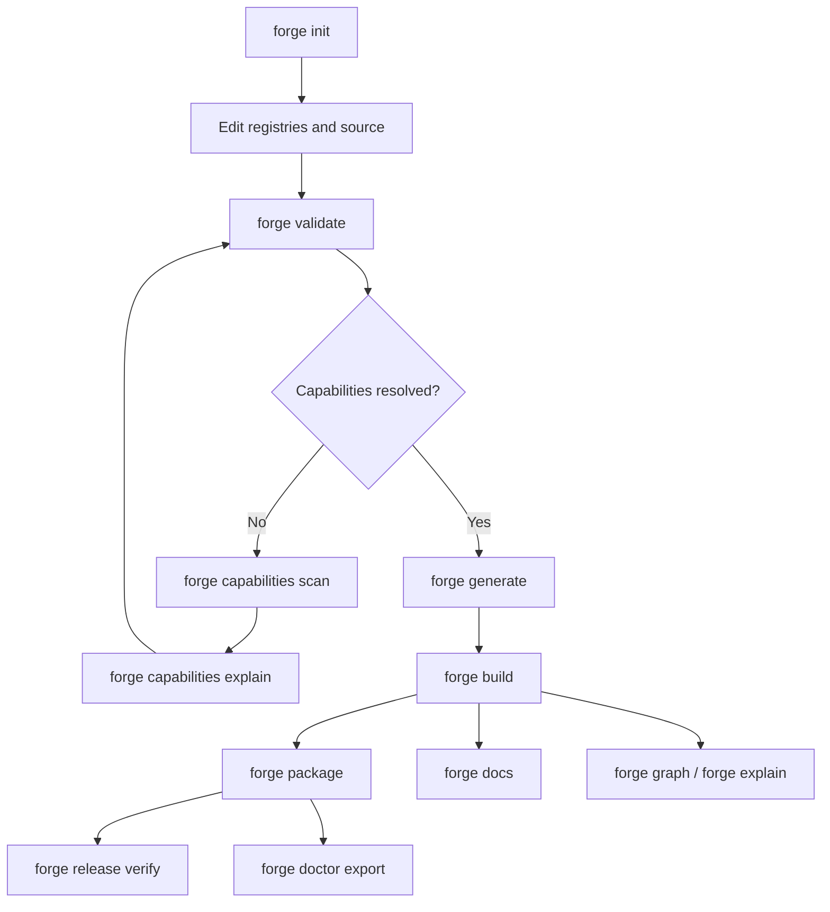
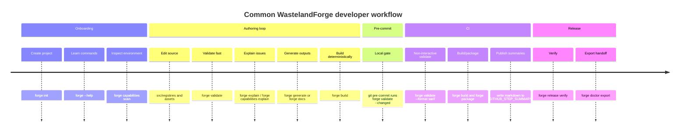

# R006 Developer Experience and CLI Workflow Model for WastelandForge

## Executive summary

The developer-facing CLI should be treated as one of WastelandForge’s most stable public APIs, because command surfaces are hard to change once people script against them. The strongest external guidance converges on the same themes: keep names consistent and discoverable, use subcommands as grouping areas rather than vague action buckets, minimise short aliases, standardise `--help` and `--version`, keep help example-led, and design for both humans and automation from the start. GNU’s command-line guidance, Microsoft’s `System.CommandLine` design guidance, and CLIG all point in that direction. citeturn3view1turn24view4turn26view2turn24view0turn18view0

For WastelandForge, the recommended model is a **hybrid verb-and-namespace CLI**. Top-level actions should stay short and explicit: `init`, `validate`, `generate`, `build`, `package`, `docs`, `graph`, `explain`, and `clean`. Grouped domains that naturally need their own verbs should be nouns: `capabilities`, `release`, and `doctor`. In practice that means `forge capabilities scan`, not `forge scan`, and `forge doctor export`, not `forge doctor-integration`. That structure aligns with mature CLI guidance, avoids future namespace collisions, and keeps the UX script-safe as the platform grows. citeturn24view4turn26view4turn29view2

The CLI should be **offline-first and AI-optional**. Every core workflow—project discovery, validation, capability scanning, generation, build planning, packaging, documentation, provenance inspection, and CI output—should work locally with no network requirement and no API key. AI assistance, if it arrives later, should live in optional packages or namespaces and must never become the correctness path for validation, capability detection, generation, or release gating. That requirement comes from the WastelandForge platform constraints in your roadmap; it is also consistent with CLIG’s warning against creating hidden network dependencies or “time bombs” in command-line tools. citeturn29view2

The output model should be deliberately split. Human-facing terminal output should be concise, example-led, and TTY-aware. Machine-facing output should be explicit and stable: JSON for local automation and editor tooling, SARIF 2.1.0 for diagnostics in CI and code review. GitHub Actions already provides native mechanisms for file/line annotations, job summaries, step outputs, and SARIF ingestion, so WastelandForge should integrate with those instead of inventing a GitHub-specific ad hoc protocol. citeturn19view3turn5view0turn5view2turn4view1turn27view0turn28view2

The single most important UX recommendation is therefore this: **thin wrappers, thick CLI**. Put policy, validation, build planning, explanation, and formatting into the `forge` binary. Keep Git hooks, editor tasks, and GitHub Actions as shallow entrypoints that invoke the same stable commands and consume the same stable output contracts. That is not just cleaner architecture; recent empirical work on GitHub Actions indicates that workflow files change frequently, and that larger or more complex workflows are associated with higher maintenance effort and higher failure risk. citeturn0academia4turn2academia8

## Design constraints and UX principles

A good WastelandForge CLI starts by accepting that the command line is both a **conversation** and an **automation surface**. CLIG’s central framing is that users rarely get a command right first time; they iterate, read errors, retry, and learn through feedback. The best CLI therefore explains what happened, suggests what to do next, and makes multi-step workflows legible. That is especially important for Forge, where a failed build may involve contracts, capabilities, generators, provenance, and packaging rather than one obvious syntax mistake. citeturn29view0turn29view1turn29view2

The sources also support a specific naming discipline. Commands that perform actions should read as verbs; options should read as nouns. Names should be lowercase and kebab-cased. Short aliases should be sparse and conventional: `-i` for `--interactive`, `-o` for `--output`, and `-v` for `--verbosity`. GNU additionally recommends consistent long options such as `--verbose`, and both GNU and CLIG expect `--help` and `--version` to exist everywhere. citeturn26view2turn26view3turn26view4turn3view1

That leads directly to a WastelandForge CLI principle set:

- **verbs for primary actions**: `validate`, `generate`, `build`, `package`
- **nouns for grouped domains**: `capabilities`, `release`, `doctor`
- **lowercase kebab-case names only**
- **minimal stable aliases only**
- **examples-first help**
- **no hidden defaults that guess a missing subcommand**
- **no arbitrary prefix abbreviations**

The last two rules matter more than they seem. CLIG explicitly warns against catch-all omitted subcommands and implicit abbreviations because they block future expansion and silently break old scripts. That is exactly why `forge scan` should not become a top-level shortcut for `forge capabilities scan`: it would spend namespace that WastelandForge may later need for asset scanning, package scanning, or doctor scanning. citeturn24view0turn29view2

The help system should therefore behave like a modern Git-style tool. `forge`, `forge --help`, and `forge -h` should all show top-level help. `forge help validate`, `forge validate --help`, and `forge validate -h` should all show subcommand help. Help pages should front-load common commands and examples, include a support path, and link to the richer web documentation where appropriate. citeturn24view0turn24view3turn3view1

Interactivity must be conservative. CLIG recommends prompting only when `stdin` is a TTY, providing a `--no-input` escape hatch, and keeping Ctrl+C responsive. Microsoft’s .NET guidance also reserves `-i` / `--interactive` for cases where a command may need to prompt, and warns that `--interactive` should not be combined carelessly with `--verbosity Quiet`. For WastelandForge, that implies **non-interactive by default in CI and non-TTY contexts**, with interactive prompts allowed only in TTY sessions and only for well-defined cases such as scaffolding, setup confirmation, or destructive safety prompts. citeturn23view1turn26view2turn29view2

## Command surface and workflow model

The recommended command surface is shown below. It is intentionally small. It covers the core lifecycle exposed by the earlier WastelandForge architecture—contracts, registries, capability resolution, validation, deterministic generation, packaging, provenance, and future doctor handoff—without turning the CLI into a bag of one-off verbs.

### Recommended top-level command model

| Command | Primary input | Primary output | Main exit codes | Required external capabilities |
|---|---|---|---|---|
| `forge init` | destination path, template, game | scaffolded project | `0,2,5,6,8` | none |
| `forge validate` | project root or cwd | diagnostics in human/plain/json/sarif | `0,1,2,3,4,8` | none for schema/semantic; optional local provider scan |
| `forge capabilities list` | built-in and project catalogues | capability catalog view/json | `0,2,3,8` | none |
| `forge capabilities scan` | game path, dev environment, optional MO2 instance | detected providers/capabilities | `0,1,2,3,4,8` | local filesystem and detectors only |
| `forge capabilities explain` | capability ID or provider ID | resolution and failure explanation | `0,1,2,3,4,8` | detector results or catalogue only |
| `forge generate` | project root, target(s) | deterministic generated artefacts | `0,1,2,3,4,5,8` | target-dependent |
| `forge build` | project root, build target(s), phase | validated build outputs + build manifest | `0,1,2,3,4,5,8` | target-dependent |
| `forge package` | build outputs, package config | staged package / archive | `0,1,2,3,5,6,8` | none beyond built outputs |
| `forge release verify` | package, changelog, version metadata | release readiness report | `0,1,2,3,5,8` | none |
| `forge docs` | project source, schemas, registries | generated docs/site/docs artefacts | `0,1,2,3,5,8` | none |
| `forge graph` | project root, graph subject | mermaid/json/dot graph | `0,1,2,3,8` | none |
| `forge explain` | diagnostic ID, target, output path, capability ID | provenance / reasoned explanation | `0,1,2,3,4,8` | none |
| `forge clean` | scope (`generated`, `dist`, `cache`, `all`) | removed outputs + report | `0,2,3,6,8` | none |
| `forge doctor export` | project/build/package metadata | redacted handoff bundle for Doctor | `0,1,2,3,5,8` | none |

This surface follows the external guidance closely. Grouping commands such as `capabilities`, `release`, and `doctor` behave as areas and should show help if invoked without a subcommand; action commands such as `validate`, `build`, and `package` should do work directly. That is exactly the distinction Microsoft recommends for subcommand-based CLIs. citeturn24view4turn26view4

### Recommended global flags

| Flag | Meaning | Default |
|---|---|---|
| `-h`, `--help` | show help for the current command context | always available |
| `--version` | show Forge version and exit | always available |
| `-o`, `--output <path>` | output file or directory | command-specific |
| `-v`, `--verbosity <Q|M|N|D|Diag>` | human output detail level | `Normal` |
| `-q` | shorthand for quiet | off |
| `-i`, `--interactive` | permit prompts when supported | `auto` |
| `--no-input` | forbid prompts entirely | off |
| `--format <human|plain|json|sarif|github>` | output contract | `human` on TTY, `plain` on non-TTY |
| `--color <auto|always|never>` | ANSI colour behaviour | `auto` |
| `--config <path>` | explicit user/project config override | auto-discover |
| `--project <path>` | explicit project root | cwd search |
| `--explain` | include planner or capability reasoning inline | off |
| `--dry-run` | plan without mutating outputs | off |

The strongest recommendation here is to make `--format` canonical, rather than adding a growing family of convenience flags such as `--json`, `--sarif`, `--plain-json`, and `--github-annotations`. CLIG warns against unnecessary interface sprawl, and WastelandForge will need the room later for additional machines-readable artefacts such as planner output or provenance bundles. citeturn29view2

### Example command usage

```bash
forge init ./ExampleMod --template minimal-fnv

forge validate . --format human
forge validate . --format json -o artifacts/validate.json
forge validate . --format sarif -o artifacts/validate.sarif

forge capabilities scan --project .
forge capabilities explain runtime.scripting.xnvse

forge generate . --target docs
forge build . --target docs --explain
forge package . -o dist/

forge graph . --subject build --format mermaid -o generated/docs/build-graph.mmd
forge explain output generated/docs/index.md

forge clean . --generated
forge clean . --all --yes --confirm example.author.modname

forge doctor export . -o dist/doctor-handoff.json
```

### Command flow



This flow intentionally treats `validate`, `capabilities scan`, and `explain` as first-class commands, not troubleshooting afterthoughts. That matches CLIG’s conversational model: the CLI should help users recover, not just fail. citeturn29view0turn29view2

## Output, diagnostics, and contract stability

Human-readable terminal output should optimise for scanability and recovery. CLIG recommends human-first output, example-led help, suggestions when the tool can infer intent, and restraint with raw developer-only detail. Microsoft’s `System.CommandLine` guidance further recommends a standard `--verbosity` ladder—`Quiet`, `Minimal`, `Normal`, `Detailed`, `Diagnostic`—even if only three levels materially differ. For WastelandForge, that should become a stable convention across every subcommand. citeturn19view3turn29view3turn26view4

The default human output should therefore follow this structure:

- a short command header only when interactive
- grouped sections for `Load`, `Validate`, `Capabilities`, `Generate`, `Package`
- one diagnostic per line in a regex-friendly shape
- rule IDs always visible
- “next command” suggestions when relevant
- no stack traces unless `--verbosity Diagnostic`
- no spinners or animations in non-TTY output
- no colour-only meaning

CLIG explicitly recommends disabling colour when the program is not attached to a terminal or when the user asks for it, and it warns against animations in non-interactive output. The `NO_COLOR` convention provides an increasingly common cross-tool mechanism for disabling ANSI colour, with command-line or config overrides taking precedence. citeturn23view1turn20view0

### Human output recommendation

A good default human diagnostic line for WastelandForge is:

```text
ERROR WF-CAP-004 src/registries/dependencies/main.yaml:18:7
Capability runtime.scripting.xnvse >= 6.4.0 is required for target mcm-json, but no compatible provider was detected.
Try: forge capabilities scan --project .
Docs: forge explain capability runtime.scripting.xnvse
```

That line is readable in a terminal, parseable by simple editor problem matchers, and rich enough to stand on its own in CI logs.

### JSON output recommendation

CLIG strongly encourages machine-readable output where it helps usability and scripting, and it specifically recommends keeping stable machine formats separate from human-facing output. For WastelandForge, JSON should be the primary local automation format, and it should be versioned independently from the human console experience. citeturn19view3turn29view2

Illustrative `forge validate --format json` output:

```json
{
  "formatVersion": "1.0",
  "tool": {
    "name": "WastelandForge",
    "version": "0.1.0"
  },
  "command": "validate",
  "project": {
    "id": "example.author.modname",
    "root": "C:\\Mods\\ExampleMod"
  },
  "summary": {
    "errors": 1,
    "warnings": 1,
    "notes": 0
  },
  "issues": [
    {
      "ruleId": "WF-CAP-004",
      "severity": "error",
      "category": "capability",
      "message": "Required capability runtime.scripting.xnvse >= 6.4.0 was not detected.",
      "location": {
        "file": "src/registries/dependencies/main.yaml",
        "line": 18,
        "column": 7,
        "pointer": "/requires/capabilities/0"
      },
      "related": [
        {
          "kind": "target",
          "id": "mcm-json"
        }
      ],
      "suggestedNext": [
        "forge capabilities scan --project .",
        "forge capabilities explain runtime.scripting.xnvse"
      ],
      "helpUri": "https://docs.wastelandforge.dev/rules/WF-CAP-004"
    }
  ]
}
```

Recommended contract rules for JSON:

- `stdout` contains **only** the JSON document when `--format json` is selected
- incidental progress goes to `stderr`, or is suppressed
- every machine payload includes `formatVersion`
- every diagnostic includes `ruleId`, severity, location, and a stable category
- every command returns the same top-level `tool`, `command`, and `summary` shape

### SARIF recommendation

GitHub code scanning supports SARIF **2.1.0** and expects a supported subset with `runs`, `tool.driver`, `reportingDescriptor` rules, `result.level`, and at least one location. GitHub uses `reportingDescriptor.id` and `ruleId` for rule identity, supports `help.markdown`, expects relative file locations rooted to the repository, relies on fingerprints to avoid duplicate alerts, and will only use the first item in `locations[]` to decide which file to annotate. It also enforces ingestion limits such as 25,000 results per run and 10 MB compressed SARIF uploads. citeturn4view3turn4view4turn25view1turn25view3turn28view2

That makes SARIF a very good fit for WastelandForge diagnostics, provided you map the existing WFG rule families directly:

- `WF-SRC-*`
- `WF-SCHEMA-*`
- `WF-MAN-*`
- `WF-REG-*`
- `WF-SEM-*`
- `WF-DEPS-*`
- `WF-CAP-*`
- `WF-GEN-*`
- `WF-OUT-*`
- `WF-PKG-*`
- `WF-REL-*`

Illustrative SARIF output for `WF-CAP-004`:

```json
{
  "$schema": "https://json.schemastore.org/sarif-2.1.0.json",
  "version": "2.1.0",
  "runs": [
    {
      "tool": {
        "driver": {
          "name": "WastelandForge",
          "semanticVersion": "0.1.0",
          "rules": [
            {
              "id": "WF-CAP-004",
              "name": "provider-installed-in-wrong-scope",
              "shortDescription": {
                "text": "Capability installed in the wrong scope"
              },
              "fullDescription": {
                "text": "A required provider was detected, but not in an install scope visible to the requested workflow."
              },
              "defaultConfiguration": {
                "level": "error"
              },
              "help": {
                "markdown": "xNVSE must be visible from the game root. Run `forge capabilities scan` to inspect the detected install scope."
              }
            }
          ]
        }
      },
      "results": [
        {
          "ruleId": "WF-CAP-004",
          "level": "error",
          "message": {
            "text": "Required capability runtime.scripting.xnvse >= 6.4.0 was found in Data/ but must be visible from the game root."
          },
          "locations": [
            {
              "physicalLocation": {
                "artifactLocation": {
                  "uri": "src/registries/dependencies/main.yaml",
                  "uriBaseId": "%SRCROOT%"
                },
                "region": {
                  "startLine": 18,
                  "startColumn": 7
                }
              }
            }
          ],
          "partialFingerprints": {
            "primaryLocationLineHash": "wfcap004:src/registries/dependencies/main.yaml:18"
          }
        }
      ]
    }
  ]
}
```

GitHub can also convert SARIF into pull-request annotations when the reported location exists in the diff, which is another reason to keep WastelandForge diagnostics line-precise and repository-root-relative. citeturn28view2

### GitHub-specific output modes

GitHub Actions exposes two useful classes of output for Forge wrappers. First, raw workflow commands such as `::notice`, `::warning`, and `::error` can create log annotations associated with files and lines. Second, job summaries can be written as Markdown through `GITHUB_STEP_SUMMARY` and shown on the run summary page. Step outputs can be set using `GITHUB_OUTPUT`. citeturn5view0turn5view2turn5view3turn4view1turn27view0

That suggests a clean split:

- `--format sarif` for durable diagnostics and PR code-scanning views
- `--format github` for lightweight real-time annotations
- `--summary markdown --summary-output <path>` for CI summaries
- wrapper actions, not the core CLI, should write CI step outputs via `GITHUB_OUTPUT`

Example CI-oriented usage:

```bash
forge validate . --format sarif -o artifacts/wf.sarif
forge validate . --format github
forge validate . --summary markdown --summary-output "$GITHUB_STEP_SUMMARY"
```

### Exit codes

WastelandForge should publish a stable exit-code contract. The recommendation is:

| Exit code | Meaning |
|---|---|
| `0` | success; no blocking issues |
| `1` | command completed, but blocking diagnostics were found |
| `2` | CLI usage or parse error |
| `3` | project/config discovery error |
| `4` | capability or environment resolution failure |
| `5` | external tool/provider execution failure |
| `6` | unsafe operation refused or confirmation required |
| `7` | interrupted or cancelled |
| `8` | internal error or unhandled exception |

This split is more useful than a single generic non-zero failure, especially in CI and editor tooling. It lets wrappers distinguish “the project is invalid” from “the environment is missing xNVSE” from “the user tried to run `clean --all` without confirmation”.

### Provenance display

A separate top-level `provenance` command is not necessary in the MVP. Provenance should be surfaced through `forge explain` and build/package commands:

```bash
forge explain output generated/docs/index.md
forge explain target docs
forge build . --explain
```

The displayed provenance should include the generator ID, source hash, schema versions, input files, selected capabilities, and output path. That keeps provenance inside the same “conversation” model already encouraged by CLIG. citeturn29view1turn29view2

## Workspace, configuration, and integration surface

The project layout should be opinionated. The CLI is vastly easier to teach, document, validate, and automate if every WastelandForge project looks broadly similar.

### Recommended project layout

| Path | Role | Mutability |
|---|---|---|
| `wastelandforge.yaml` | root project manifest and registry index | canonical source |
| `src/registries/` | contracts and registry documents | canonical source |
| `src/assets/` | source-owned loose assets and metadata | canonical source |
| `src/docs/` | human-authored docs and templates | canonical source |
| `generated/` | generated docs, scripts, reports, metadata | disposable output |
| `dist/` | staged/releaseable packages | disposable output |
| `.wastelandforge/cache/` | incremental planner/cache state | disposable local state |
| `.wastelandforge/logs/` | diagnostic and debug logs | disposable local state |

This layout preserves the earlier WastelandForge principle that generated artefacts are outputs, not truth, while still making common workflows obvious to new contributors.

### Config precedence and locations

CLIG recommends a clear precedence order for configuration: flags first, then environment variables, then project-level configuration, then user-level configuration, then system-wide defaults. It also distinguishes between per-invocation settings, per-user settings, and project-stable configuration that belongs in version control. That maps almost perfectly onto WastelandForge’s architecture. citeturn19view0turn24view3

Recommended precedence:

1. explicit flags
2. environment variables
3. project manifest and project-local config
4. user config
5. built-in defaults

Recommended locations:

- **project config**: root `wastelandforge.yaml`
- **project local state**: `.wastelandforge/`
- **user config**: OS-appropriate app config directory
- **user cache**: OS-appropriate app cache directory

The root manifest should remain small; anything that belongs to the whole project and should be version-controlled goes there or in indexed files beneath `src/registries/`.

### Recommended environment variables

CLIG’s environment-variable guidance is useful here. Environment variables are appropriate for context-dependent behaviour, should use uppercase names, and should not become a dumping ground for secrets. CLIG also explicitly warns against reading secrets from ordinary environment variables because they leak too easily into process state and logs. citeturn19view0

Recommended WastelandForge environment variables:

| Variable | Purpose |
|---|---|
| `WF_PROJECT` | explicit project root override |
| `WF_CONFIG` | explicit config file override |
| `WF_CACHE_DIR` | cache location override |
| `WF_LOG_DIR` | log directory override |
| `WF_VERBOSITY` | default verbosity |
| `WF_FORMAT` | default output format |
| `WF_NO_INPUT` | force non-interactive mode |
| `WF_GAME_DIR` | default Fallout: New Vegas root |
| `WF_DATA_DIR` | default Data folder override |
| `WF_MO2_INSTANCE` | default MO2 instance/profile locator |
| `NO_COLOR` | disable ANSI colour by default |
| `CI` | signal non-interactive CI context |
| `GITHUB_ACTIONS` | enable GitHub-specific default behaviours only where appropriate |

Important policy: release credentials, if ever needed, should not be stored in WastelandForge project files. In CI they should come from the provider’s secret store; locally they should come from an OS credential manager or an explicit one-shot environment variable for the release step only.

### Shell completions and response files

`System.CommandLine` is a strong implementation fit because it already supports consistent parsing, help text, tab completion, and response files, and it is trim-friendly for lightweight CLI distribution. For tab completion in arbitrary `System.CommandLine` applications, Microsoft currently documents a model based on the `dotnet-suggest` global tool plus shell profile shims for Bash, Zsh, and PowerShell. It also notes that `cmd.exe` has no pluggable tab-completion mechanism in this model. citeturn11view0turn11view1turn26view0turn11view4turn11view5turn11view6

For WastelandForge, the UX implication is:

- first-class completion support for **PowerShell**, **Bash**, and **Zsh**
- no completion-heavy investment in `cmd.exe` for the MVP
- a wrapper command such as `forge completion install pwsh` should hide `dotnet-suggest` details from users
- response files should be supported and documented for long CI or editor invocations

Example:

```bash
forge @ci-validate.rsp
```

That is especially useful when CI or editor tasks need many repeated flags.

### Editor integrations

VS Code is the best first-class editor target for the MVP. Its tasks system supports workspace `tasks.json`, OS-specific command overrides, variable substitution, problem matchers, and background tasks. Problem matchers can parse command output directly, and background watch tasks require both a background-aware problem matcher and `isBackground: true`. citeturn13view0turn13view1turn13view2turn13view3

That leads to two complementary editor integration modes:

- **plain-text diagnostics mode** for quick task and problem-matcher integration
- **JSON diagnostics mode** for a richer future extension or language-server-style adapter

Recommended plain diagnostic shape:

```text
src/registries/dependencies/main.yaml(18,7): error WF-CAP-004: Required capability runtime.scripting.xnvse >= 6.4.0 was not detected.
```

Recommended VS Code task:

```json
{
  "label": "Forge: Validate",
  "type": "shell",
  "command": "forge",
  "args": ["validate", ".", "--format", "plain"],
  "problemMatcher": {
    "owner": "wastelandforge",
    "fileLocation": "relative",
    "pattern": {
      "regexp": "^(.*)\\((\\d+),(\\d+)\\):\\s+(error|warning|note)\\s+(WF-[A-Z]+-\\d+):\\s+(.*)$",
      "file": 1,
      "line": 2,
      "column": 3,
      "severity": 4,
      "code": 5,
      "message": 6
    }
  }
}
```

For watch workflows later, `forge validate --watch` and `forge docs --watch` can map into VS Code background tasks.

### Git hooks

Git’s hook system supports project-local interception at commit and merge time, and the hooks directory can be relocated through `core.hooksPath`. `pre-commit` and `commit-msg` can abort a commit with a non-zero exit code, while `prepare-commit-msg` can edit the message but is not suppressed by `--no-verify`. citeturn10view0turn17view0turn17view1turn17view2

The best WastelandForge pattern is therefore **version-controlled hooks**, not hand-installed `.git/hooks` scripts:

```bash
git config core.hooksPath .githooks
```

Recommended hooks:

- `pre-commit`: `forge validate --changed --format plain`
- `commit-msg`: optional commit metadata or ADR reference checks
- no build or package steps in hooks by default

Keep hooks fast. Anything expensive belongs in CI.

## Workflow patterns, CI, onboarding, and safety

The workflow design should reinforce one idea: **the same commands drive local development, editor tooling, hooks, and CI**. A contributor should not have to learn one Forge for the terminal and another Forge hidden inside GitHub Actions YAML.

Recent empirical research on GitHub Actions supports that choice. One 2026 study found that workflow changes are frequent and usually small, while another found that larger and more complex GitHub Actions workflows are associated with higher failure rates and more maintenance effort. For WastelandForge that argues strongly for putting behaviour into the CLI and keeping workflow YAML thin. citeturn0academia4turn2academia8

### Recommended common workflows



### CI integration patterns

GitHub Actions already supports all the primitives WastelandForge needs in the MVP. Workflow commands can create `notice`, `warning`, and `error` annotations tied to files and lines. `GITHUB_OUTPUT` can expose step outputs. `GITHUB_STEP_SUMMARY` can publish Markdown summaries per step, grouped at the job level on the run page. SARIF 2.1.0 can be uploaded to code scanning, where GitHub uses rule IDs, levels, locations, and fingerprints to show persistent alerts without duplication. citeturn5view0turn5view2turn5view3turn4view1turn27view0turn28view2

Recommended GitHub Actions pattern:

1. run `forge validate . --format sarif -o artifacts/wf.sarif`
2. upload SARIF to code scanning
3. optionally run `forge validate . --format github` for immediate inline annotations
4. run `forge validate . --summary markdown --summary-output "$GITHUB_STEP_SUMMARY"`
5. run `forge build .`
6. run `forge package . -o dist/`

That keeps the workflow readable and keeps formatting logic inside the CLI, where it can be tested and versioned.

### Example CI usage

```bash
forge validate . --format sarif -o artifacts/wf.sarif
forge validate . --summary markdown --summary-output "$GITHUB_STEP_SUMMARY"
forge build . --verbosity minimal
forge package . -o dist/
```

### Capability detection UX

Capability gating is where UX quality matters most. When a generator or build target is blocked by a missing capability, the CLI should never stop at “missing dependency”. It should answer four questions in order:

1. **what was required**
2. **what was detected**
3. **why detection failed or why the scope/version was wrong**
4. **what command should the user run next**

That is a direct application of CLIG’s “conversation” model and its recommendation to suggest corrective commands rather than just reject input. citeturn29view2turn29view3

Recommended interaction:

```text
ERROR WF-CAP-003
Target mcm-json requires runtime.ui.mcm_extender >= 1.0.0.

Detected:
  provider.runtime.mcm_extender 0.9.0 (unsupported version)

Next:
  forge capabilities scan --project .
  forge capabilities explain runtime.ui.mcm_extender
```

### Developer onboarding

Help pages should lead with common examples, not abstract option dumps. CLIG explicitly recommends examples-first help and suggests fuller tutorials or web pages for complex integrations. `forge init` should therefore do more than create files: it should print the next three commands the user is expected to run. A minimal project template, a docs-only template, and a runtime-enabled template are enough for the MVP. citeturn24view0turn24view3

Recommended `forge init` post-create message:

```text
Project created: example.author.modname

Next steps:
  1. forge validate .
  2. forge capabilities scan --project .
  3. forge docs .

Docs:
  forge help init
```

### Unsafe operations and destructive commands

CLIG distinguishes between mild, moderate, and severe destructive risks, and it recommends making severe actions hard to confirm accidentally. `clean --all` fits that category in Forge because it can remove generated outputs, packaging state, and caches across the whole workspace. citeturn23view1

Recommended behaviour:

- `forge clean --generated` and `forge clean --dist` are safe and non-interactive by default
- `forge clean --cache` is safe but should warn if a build is active
- `forge clean --all` requires both `--yes` and `--confirm <project-id>` in non-interactive mode
- in interactive TTY mode, `clean --all` should require the user to type the project ID

Example:

```bash
forge clean . --all --yes --confirm example.author.modname
```

### Accessibility and privacy

CLIG recommends intentional colour use, no colour when not in a TTY, and explicit opt-in if you collect analytics. The `NO_COLOR` convention additionally standardises how users can suppress ANSI colour globally. For WastelandForge that leads to a simple policy: **no telemetry by default, no analytics collection in the MVP, and opt-in only if telemetry ever arrives later**. Human output must remain fully usable without colour, and plain text should stay copyable and screen-reader-friendly. citeturn23view1turn20view0

Recommended accessibility defaults:

- no meaning conveyed by colour alone
- `ERROR`, `WARN`, and `NOTE` labels always printed as text
- `--color auto`, disabled in non-TTY or when `NO_COLOR` is set
- `--format plain` for screen readers, logs, and problem matchers
- no emoji in default output
- no spinner in non-TTY output
- stable ordering of diagnostics and sections

## MVP implementation slice and ADR recommendation

The implementation target should be a **small, testable CLI substrate**, not a giant monolith. `System.CommandLine` is a sensible base because it already gives WastelandForge consistent parsing, help generation, tab completion hooks, response files, and a lightweight distribution profile. citeturn11view0turn26view0

### Recommended MVP modules

| Module | Responsibility |
|---|---|
| `WastelandForge.Cli` | command tree, parser, help, dispatch |
| `WastelandForge.Cli.Abstractions` | common interfaces for output, prompts, environment, project location |
| `WastelandForge.Cli.Formatters` | human/plain/json/sarif/github formatters |
| `WastelandForge.Cli.Diagnostics` | issue rendering and exit-code mapping |
| `WastelandForge.Cli.Capabilities` | `capabilities list/scan/explain` command handlers |
| `WastelandForge.Cli.Build` | `generate`, `build`, `package`, `docs`, `graph`, `explain` handlers |
| `WastelandForge.Cli.Integrations` | GitHub summary/annotation emitters, editor task helpers, hook install helpers |
| `WastelandForge.Cli.Tests` | parser tests, help snapshots, TTY/non-TTY snapshots, JSON/SARIF contract tests |

### Recommended interfaces

```text
ICommandHandler
IProjectLocator
IConfigResolver
IEnvironmentContext
IOutputWriter
IDiagnosticFormatter
IInteractivePrompter
ICapabilityScanService
ICapabilityExplainService
IBuildPlanner
IProvenanceReader
ISummaryWriter
IExitCodeMapper
```

### Recommended MVP command set

The minimum genuinely useful CLI slice is:

```text
forge init
forge validate
forge capabilities list
forge capabilities scan
forge capabilities explain
forge docs
forge build
forge clean
forge explain
```

`package` should arrive as soon as build manifests and staging are stable. `release prepare` and `release verify` should follow. `release publish` should wait until release governance is locked down. `doctor export` can arrive early if it is implemented as a pure local bundle exporter using the same shared contracts.

### Recommended MVP tests

| Test class | Purpose |
|---|---|
| parser tests | command names, flags, aliases, invalid forms |
| help snapshot tests | top-level and subcommand help stability |
| TTY mode tests | human vs plain output behaviour |
| JSON contract tests | stable machine output |
| SARIF contract tests | GitHub-compatible SARIF 2.1.0 shape |
| capability UX tests | missing/optional/wrong-scope explanations |
| safety tests | `clean --all` refusal and confirmation flows |
| Windows path tests | spaces, backslashes, case-insensitive paths |
| completion tests | generated/installed completion scripts |
| hook/task template tests | Git hook and VS Code scaffold correctness |

### ADR recommendation

**ADR-010 — Developer Experience and CLI Workflow Model**

**Decision**

WastelandForge should adopt a **small, stable, offline-first, AI-optional CLI** with:

- verb-first top-level lifecycle commands
- noun-based grouped namespaces where a domain needs multiple verbs
- explicit machine-readable output contracts
- human-friendly, TTY-aware terminal output
- strict non-interactive behaviour in CI and non-TTY contexts
- capability scanning and explanation as first-class UX
- thin integrations for Git hooks, editors, and GitHub Actions
- provenance surfaced through `build` and `explain`, not hidden side channels

**Canonical command surface**

```text
forge init
forge validate
forge capabilities list|scan|explain
forge generate
forge build
forge package
forge release verify|prepare|publish
forge docs
forge graph
forge explain
forge clean
forge doctor export
forge help
forge --version
```

**Consequences**

- Forge’s CLI becomes a stable script surface rather than a thin wrapper over internals.
- GitHub Actions, editor tasks, and Git hooks can all call the same commands and consume the same outputs.
- Capability failure becomes diagnosable instead of mysterious.
- JSON and SARIF make Forge legible to CI, editors, and future Doctor tooling.
- Offline-first usage remains intact; AI stays entirely outside the correctness path.
- Future growth stays manageable because `scan`, `release`, and `doctor` remain namespaced rather than ad hoc top-level verbs.

The architectural summary is straightforward: **WastelandForge should not be a collection of scripts around the engine ecosystem. It should be a coherent developer tool with a disciplined CLI, stable machine contracts, and recoverable workflows.**