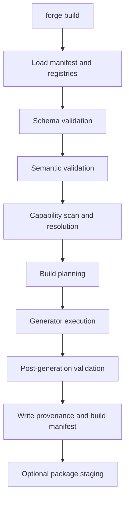
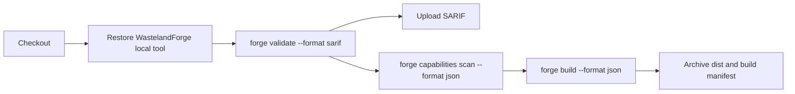

# WastelandForge Developer Experience and CLI Workflow Model

## Executive summary

The strongest model for WastelandForge v0.1 is a **subcommand-based CLI** with a small, stable surface modelled after modern developer tools such as `dotnet`, Cargo, npm and NuGet, while also respecting the environmental realities of Fallout: New Vegas tooling such as xEdit, LOOT and MO2. The command surface should be **offline-first**, **AI-optional**, **capability-driven**, and **provenance-first**. In practical terms, that means: deterministic commands that work without cloud services; explicit environment and capability checks before generation; versioned machine-readable outputs; and build artefacts that always record which source inputs, generators and capability resolutions produced them. `System.CommandLine` is a good fit for implementation because it already underpins .NET-style CLIs, supports consistent parsing across Windows and POSIX conventions, and includes help/completion features. citeturn17view4turn18view8turn30view0turn25view2

For v0.1, the CLI should prioritise a disciplined “inner loop” rather than breadth. The core commands should be `init`, `validate`, `capabilities scan`, `plan`, `build`, `docs`, `package`, `clean`, and `config`, with `watch` included either as preview or as a constrained incremental wrapper over `validate` and `build`. This follows the precedent of `dotnet new`, `dotnet watch`, Cargo’s `init`, `build`, `metadata`, and npm’s `init`/workspaces patterns, while avoiding the temptation to turn Forge into a replacement for xEdit, LOOT, MO2 or GECK. xEdit and LOOT both expose meaningful command-line control, but mostly around explicit game selection, startup mode or automation parameters; MO2 exposes some automation surfaces, but its CLI remains comparatively under-documented and should therefore be treated as an integration point, not a stable foundation for core UX. citeturn18view6turn18view5turn34search0turn17view3turn37view0turn17view0turn17view2turn29view0

The output model should be deliberately dual-track: **human-readable by default**, **machine-readable on demand**. Cargo is particularly instructive here: it has versioned metadata output and JSON line-oriented build events, and it explicitly recommends passing a format version to avoid forward-compatibility hazards. GitHub Actions supports both direct annotations and SARIF ingestion, which means WastelandForge should emit at least `human`, `json`, `jsonl`, `sarif`, and `github` formats. The diagnostic `ruleId` should remain identical across console output, JSON, SARIF and eventual LSP diagnostics so that `WF-DEPS-*`, `WF-CAP-*` and `WF-GEN-*` remain the stable identity of a problem regardless of where it is displayed. citeturn17view3turn30view0turn20view1turn20view0turn17view7turn18view7

For CI/CD and editors, the design should assume **PowerShell on Windows**, because GitHub Actions uses `pwsh` as the default Windows shell, and it should assume **schema- and diagnostics-first integration** for VS Code. VS Code tasks and problem matchers already provide a lightweight bridge for command output into the editor, while JSON schema associations and YAML language-server schema associations allow strong completion and validation without any AI requirement. A small VS Code extension can come later, but v0.1 does not need one if the CLI emits consistent diagnostics and the project ships its schemas. citeturn20view3turn20view6turn22view3turn17view6turn28view0turn23view2

On Windows, the CLI must actively defend users from the common New Vegas modding foot-guns: installs inside `Program Files`, long path pressure, root-vs-data install scope confusion, and permission redirection or protection. Microsoft documents both the path-length constraint and UAC-protected areas, and Viva New Vegas explicitly recommends installing outside default Windows folders because those protections can break mod tools and mods. WastelandForge should therefore make environment diagnostics a first-class experience during `init`, `capabilities scan` and `build`. citeturn20view7turn11search1turn11search12turn20view8

**ADR-010 recommendation:** WastelandForge v0.1 should adopt a **subcommand-based, versioned, deterministic CLI**, implemented as a .NET local tool and/or standalone executable, with explicit capability scanning, versioned machine-readable output, stable diagnostic IDs, and a strict separation between canonical source, generated output and environment state. AI assistance should remain optional and out of the correctness path.

## Design goals and governing principles

The CLI should reflect the same architectural rules that earlier WastelandForge research established for the platform itself. Existing developer tools converge on several compatible patterns: command hierarchies with subcommands, layered configuration, explicit machine-readable output modes, and specialised automation flags such as `--non-interactive`, `--offline`, `--locked`, `--watch`, or `--game-path`. Cargo, npm, NuGet, dotnet, LOOT and xEdit all demonstrate pieces of this pattern, even though they serve very different domains. citeturn19view1turn30view0turn18view2turn25view2turn37view0turn17view0

For WastelandForge, that translates into five governing UX principles:

| Principle | What it means for the CLI | Recommended consequence |
|---|---|---|
| Offline-first | No required network for validation, planning, generation, docs or packaging | All core commands must work without cloud services |
| AI-optional | AI may explain or draft, but never decides correctness | No command should require API keys or hosted inference |
| Capability-driven | External tools and runtime extensions are detected, not assumed | `capabilities scan` and capability-gated `build` are core UX |
| Provenance-first | Generated output is traceable back to source and generator | Every build writes a build manifest and generator metadata |
| Automation-grade | CLI must be scriptable, CI-safe and editor-friendly | Stable exit codes, JSON/SARIF/GitHub output, non-interactive mode |

The layering of configuration should also be deliberate. npm uses per-project, per-user, global and built-in config files; Cargo uses hierarchical local and global config with explicit precedence rules; NuGet uses explicit config file locations and per-user defaults. Those patterns support a clear WastelandForge rule: **project intent lives in version-controlled source contracts**, while **developer-machine preferences live in local config**, and **CLI invocation flags override everything else**. citeturn18view2turn33view4turn19view3

The recommended precedence order is:

| Precedence | Scope | Purpose |
|---|---|---|
| Command-line flags | per invocation | Deterministic overrides in scripts and CI |
| Environment variables | per process or runner | CI, shells, editor tasks |
| Workspace CLI config | repo-local | Developer workflow preferences for this repo |
| User CLI config | machine-local | Personal defaults, tool paths, editor integration |
| Built-in defaults | shipped with CLI | Stable fallback behaviour |

This mirrors Cargo’s “command line > environment variables > config files” precedence, while preserving npm-style project-local workflow configuration where useful. citeturn33view4

A final principle is that installation should prefer **repository-pinned tooling**. .NET local tools use a checked-in manifest under `.config/dotnet-tools.json`, allowing teams to restore a known tool version in the current repository and its subdirectories. That is the right pattern for WastelandForge too: it reduces “works on my machine” drift, makes CI reproducible, and gives teams a single place to pin the CLI version that their contracts, generators and diagnostics expect. citeturn19view7

## Command model and syntax

A WastelandForge CLI should follow a conventional, discoverable grammar:

```text
forge [global-options] <command> [subcommand] [command-options] [arguments]
```

That is aligned with `System.CommandLine` parsing conventions, dotnet’s command tree, Cargo’s subcommand model, and npm/NuGet command shapes. It is familiar, scriptable and easy to document. citeturn18view8turn19view1turn30view1turn25view2

### Recommended command set

The naming choice should favour clarity over cleverness. The table below compares likely alternatives and recommends a v0.1 surface shaped by established tool verbs such as `new/init`, `build`, `watch`, `help`, `config`, `metadata`, and `pack/package`. citeturn18view6turn34search0turn18view5turn17view3turn25view2

| Concern | Alternatives considered | Recommendation | Why |
|---|---|---|---|
| Create a project | `new`, `init` | `init` | Clearer for repo initialisation; pairs well with templates |
| Validate source | `check`, `lint`, `validate` | `validate` | Broad enough for schema + semantic + dependency validation |
| Scan environment | `doctor`, `env`, `capabilities scan` | `capabilities scan` | More precise; avoids colliding with future player-facing Doctor product |
| Build outputs | `generate`, `build` | `build` | Implies planning + generation + post-validation |
| Show build plan | `graph`, `plan`, `explain` | `plan` and `explain` | `plan` for machine-readable plan; `explain` for human why/how |
| Produce docs | `doc`, `docs` | `docs` | Matches common plural convention |
| Create distributable | `pack`, `package`, `release` | `package` | More explicit than `pack`; `release` should remain publish-oriented |
| File watching | `watch`, `dev` | `watch` | Matches dotnet and editor tasks terminology |
| Settings | `config`, `settings` | `config` | Standard across developer CLIs |

The recommended MVP command tree is:

```text
forge init
forge validate
forge capabilities list
forge capabilities scan
forge plan
forge build
forge watch
forge docs
forge package
forge clean
forge explain
forge config get|set|list
forge help
forge version
```

### Global flags

The global flag model should be boring in the best sense: hard to misuse, easy to remember, good in CI.

| Flag | Recommendation | Rationale |
|---|---|---|
| `-p, --project <PATH>` | Yes | Clear project root or manifest target |
| `--format <FMT>` | Yes | `human`, `json`, `jsonl`, `sarif`, `github` |
| `--format-version <N>` | Yes | Stabilises machine output contracts |
| `--output <PATH>` | Yes | Write machine output to file instead of stdout |
| `-v, --verbosity <LEVEL>` | Yes | `quiet`, `minimal`, `normal`, `detailed`, `diagnostic` |
| `--color <WHEN>` | Yes | `auto`, `always`, `never` |
| `--interactive` / `--non-interactive` | Yes | Must be explicit and CI-safe |
| `-y, --yes` | Yes | Non-interactive confirmation for destructive operations |
| `--language <CULTURE>` | Yes | Human output localisation when desired |
| `--force-english-output` | Alias | Useful in mixed-language Windows/CI environments |
| `--no-logo` | Yes | Keeps CI logs clean |
| `--config <PATH>` | Yes | Explicit override file, cargo-style |

The recommendation for `verbosity`, `color`, `non-interactive`, `help`, and language forcing follows directly from existing practice in dotnet, Cargo and NuGet. Cargo and dotnet both provide explicit verbosity and colour controls; NuGet exposes `-NonInteractive` and `-ForceEnglishOutput`; dotnet and MSBuild support a `DOTNET_CLI_UI_LANGUAGE` path for consistent command-line language control. citeturn19view1turn30view1turn25view2turn15search0turn38search5

### Interactive versus non-interactive

The safest rule is:

- **Default to interactive** only when all of the following are true: the command is naturally wizard-like, stdout/stderr are attached to a TTY, and the user did not pass `--non-interactive`.
- **Default to non-interactive** in CI, when stdin is not a TTY, or when `--format` is machine-readable.
- **Never block in CI**. Missing input should produce a clear diagnostic and a non-zero exit code instead.

This is consistent with NuGet’s explicit `-NonInteractive` support and with `dotnet watch`, which explicitly distinguishes interactive and non-interactive execution. citeturn25view2turn18view5

In practice:

- `forge init` may offer a small interactive wizard when safe.
- `forge build`, `forge validate`, `forge package`, and `forge capabilities scan` should be non-interactive by design unless the user explicitly requests prompts.
- Destructive commands such as `clean` or `migrate` should require either a prompt or `--yes`.

### Recommended defaults and config locations

These defaults fit New Vegas modding workflows and common CLI configuration conventions from npm, Cargo, NuGet and LOOT. citeturn18view2turn33view4turn19view3turn37view0

| Concern | Recommended default |
|---|---|
| Canonical project manifest | `wastelandforge.manifest.yaml` |
| Registry root | `registries/` |
| Generated outputs | `generated/` |
| Distribution outputs | `dist/` |
| Repo-local CLI config | `.wastelandforge/config.jsonc` |
| Repo-local cache | `.wastelandforge/cache/` |
| User config on Windows | `%LOCALAPPDATA%\WastelandForge\config.json` |
| User cache on Windows | `%LOCALAPPDATA%\WastelandForge\Cache\` |
| User logs on Windows | `%LOCALAPPDATA%\WastelandForge\Logs\` |
| Environment override root | `WF_HOME` |
| Explicit config override | `forge --config <PATH>` |

`%LOCALAPPDATA%` is the better Windows default than `%APPDATA%` because WastelandForge machine settings—game roots, MO2 instances, local caches, tool paths—are machine-specific, and LOOT already defaults its application data path to `%LOCALAPPDATA%\LOOT` on Windows. citeturn37view0

### Examples

```powershell
forge init --template fnv-basic --name "Example Mod" --game FalloutNV

forge validate --project . --format human

forge validate --project . --format sarif --output .\artifacts\wastelandforge.sarif

forge capabilities scan --project . --game-root "C:\Games\Fallout New Vegas"

forge plan --project . --format json --output .\generated\build-plan.json

forge build --project . --target docs --incremental

forge watch --project . --targets validate,docs

forge package --project . --staging .\dist\staging --output .\dist\ExampleMod-0.1.0.zip
```

### Sample help text

```text
forge build --help

USAGE:
  forge build [options]

DESCRIPTION:
  Validate the project, resolve capabilities, plan the build, run deterministic
  generators, validate generated outputs, and write build provenance.

OPTIONS:
  -p, --project <PATH>         Path to project root or manifest.
      --target <NAME>          docs|mcm|scripts|all   Default: all
      --phase <NAME>           validate|scan|plan|generate|package
      --format <FMT>           human|json|jsonl|sarif|github
      --format-version <N>     Machine output contract version. Default: 1
      --output <PATH>          Write machine-readable output to file
      --incremental            Use incremental build state when safe
      --no-incremental         Force a full rebuild
      --warnings-as-errors     Treat warnings as errors
      --interactive            Allow prompts
      --non-interactive        Never prompt
  -v, --verbosity <LEVEL>      quiet|minimal|normal|detailed|diagnostic
      --color <WHEN>           auto|always|never
      --language <CULTURE>     e.g. en-GB
      --force-english-output   Force invariant English UI strings
      --no-logo                Suppress banner
  -h, --help                   Show command help
```

Cargo’s documentation pipeline and NuGet’s markdown help output are good precedents for auto-generating CLI reference, Markdown help and manpages from the same command model. WastelandForge should do the same rather than maintaining help text in multiple places. citeturn10search23turn25view2

## Diagnostics, machine-readable outputs and exit semantics

WastelandForge’s diagnostics need one identity everywhere. The same issue should appear as:

- a human console message,
- a JSON object,
- a SARIF result,
- a GitHub annotation,
- and eventually an LSP diagnostic,

without changing its **stable `ruleId`**. That matches both the LSP diagnostic model, which treats diagnostics as resource-scoped structured objects, and SARIF/GitHub code scanning, which expects rule identifiers, locations and descriptions to remain stable across runs. JSON Schema’s own output recommendations also reinforce the value of structured locations such as evaluation path, schema location and instance location. citeturn18view7turn20view1turn20view0turn36view0

The recommended issue envelope is:

```json
{
  "ruleId": "WF-CAP-004",
  "severity": "error",
  "category": "capability",
  "title": "Capability installed in wrong scope",
  "message": "runtime.scripting.xnvse was detected under Data\\, but this provider must be visible from the game root.",
  "stage": "capability-scan",
  "source": {
    "file": "registries/dependencies/main.yaml",
    "pointer": "/requires/capabilities/0"
  },
  "location": {
    "path": "C:\\Games\\Fallout New Vegas\\Data\\NVSE\\Plugins\\...",
    "installScope": "data-managed"
  },
  "suggestedFix": "Move the provider to the game root or adapt your MO2 root-management workflow."
}
```

### Mapping to R004, R005 and R006 issue families

This report uses the diagnostic families already implied by your earlier research briefs.

| Family | Scope | Typical stage |
|---|---|---|
| `WF-SCHEMA-*` | JSON Schema or contract-shape problems | load / schema-validate |
| `WF-MAN-*` | Manifest problems | semantic-validate |
| `WF-DEPS-*` | Dependency registry and reference problems | semantic-validate |
| `WF-CAP-*` | Provider, version, scope and capability problems | capability-scan / build gate |
| `WF-GEN-*` | Generator, output, provenance and build-phase problems | generate / post-validate / package |

That mapping should remain visible in all outputs. In SARIF, `ruleId` should be the WastelandForge code; in LSP, `Diagnostic.code` should use the same value; in console mode, it should prefix the message. citeturn18view7turn20view1

### Output formats

Cargo offers the most useful precedent here: stable, versioned metadata output for tooling, and JSON line-oriented build messages for streaming consumers. GitHub adds a second important requirement: SARIF for durable code-scanning ingestion, and workflow commands for immediate annotations. citeturn17view3turn30view0turn20view1turn17view7

| Format | Best for | Streaming-friendly | GitHub-native | Recommendation |
|---|---|---:|---:|---|
| `human` | Local terminal use | No | No | Default on TTY |
| `json` | One-shot automation, scripts, file output | Limited | Indirect | Use for summaries and final reports |
| `jsonl` | `watch`, incremental builds, editor bridges | Yes | Indirect | Preferred event stream format |
| `sarif` | Validation/build diagnostics in CI | File-oriented | Yes | Required for `validate` and `build` |
| `github` | Immediate Actions annotations | Yes | Yes | Emit workflow commands directly |

The most important discipline is stream separation. Cargo warns that JSON output only governs Cargo and Rustc messages, and that external tool output can still interleave with it. dotnet has moved increasingly toward reserving `stdout` for command-relevant payloads and pushing non-command-relevant data to `stderr`, especially where structured consumers are involved. WastelandForge should therefore adopt a strict rule: **machine payloads go to stdout or to the requested output file; incidental logs, progress and narrative diagnostics go to stderr**. citeturn30view0turn32search3turn32search7

### Exit codes

GitHub Actions only distinguishes `0` from non-zero for success/failure, but richer exit codes still help local scripts and CI branching. Cargo keeps things simple with `0` and `101`; WastelandForge should use a bounded but more descriptive set. citeturn30view1turn20view2

| Exit code | Meaning | Notes |
|---|---|---|
| `0` | Success | Warnings allowed unless promoted |
| `1` | Internal or unexpected failure | Unhandled exceptions, corrupted cache, tool crash |
| `2` | Validation failure | `WF-SCHEMA-*`, `WF-MAN-*`, `WF-DEPS-*` |
| `3` | Capability/environment failure | Missing or wrong-scope providers, unsupported versions |
| `4` | Build/generation/package failure | `WF-GEN-*` during plan/generate/package |
| `5` | Usage or configuration error | Bad flags, missing required values, invalid config file |
| `6` | Cancelled or interrupted | Ctrl+C, timeout, explicit cancellation |
| `7` | Migration required / unsupported version | Config/schema/CLI mismatch requiring `forge migrate` |

Warnings should not produce non-zero exit codes by default. Instead, `--warnings-as-errors` should promote them into code `2`, `3` or `4` according to category.

## Capability detection, build phases and incremental workflows

The CLI must make capability state visible. LOOT’s command-line initialisation is a good model for explicit environmental context: it supports `--game`, `--game-path`, `--loot-data-path`, and even `--auto-sort`, which means it does not assume an ambient game state but allows the caller to declare one. xEdit similarly exposes game mode selection and extensive startup switches. MO2 does support some command-driven workflows, but the publicly documented/observable surface is comparatively fragmented, so WastelandForge should present MO2 integration as an adapter and capability, not as a CLI dependency. citeturn37view0turn17view0turn24view2turn17view2turn29view0

The correct UX shape is therefore:

- `forge capabilities list` — show built-in known capabilities/providers.
- `forge capabilities scan` — inspect the current development environment.
- `forge plan` — resolve project + capabilities + generators into an intended build graph.
- `forge build` — execute the planned graph.
- `forge explain` — explain why a capability, generator or output is present, absent, stale or blocked.

A command flow for v0.1 should look like this:



The CLI should expose build phases directly, because your earlier R006 model already distinguishes load, validate, capability resolution, planning, generation and packaging. The user experience should reflect that. GitHub Actions log grouping is a useful precedent here: WastelandForge should group output by phase in human mode and emit phase events in `jsonl` mode. citeturn17view7

A recommended human output shape is:

```text
WastelandForge Build

Load
  OK    manifest loaded
  OK    registries loaded

Validate
  OK    schema validation passed
  ERR   WF-DEPS-003 unknown capability runtime.fake.provider

Capabilities
  OK    runtime.scripting.xnvse 6.4.0 detected
  WARN  WF-CAP-002 optional capability runtime.ui.mcm_extender not detected

Plan
  OK    docs generator scheduled
  SKIP  mcm-json generator skipped; missing optional capability

Result
  1 error
  1 warning
```

### Incremental workflows and watch mode

`dotnet watch` is the clearest precedent: it watches source changes, reruns a command, and offers both interactive and non-interactive execution. VS Code tasks also have a specific concept of “background” watching tasks. WastelandForge should adopt the same mental model. citeturn18view5turn22view2

Recommended forms:

```powershell
forge watch --project . --targets validate,docs
forge watch --project . build --target docs --format jsonl
```

For v0.1, incremental logic should stay simple:

- hash relevant source inputs;
- hash capability resolution;
- hash generator version;
- reuse outputs only when all of those are unchanged.

That matches the incremental spirit of `dotnet build` and the frozen/deterministic installation model of `npm ci`, without overbuilding a premature cache system. citeturn12search0turn18view4

## Automation, CI/CD and editor integration

GitHub Actions should be treated as the default CI reference because it gives WastelandForge everything it needs: predictable shell defaults, direct annotations, grouped logs and SARIF upload. On Windows runners, `pwsh` is the default shell. GitHub annotations can be emitted with workflow commands such as `::notice`, `::warning`, and `::error`, and GitHub code scanning accepts SARIF 2.1.0 via Actions or the API. citeturn20view3turn17view7turn20view1turn17view8

A good CI model is:



Two patterns matter here.

First, **structured files beat scraped logs**. GitHub problem matchers are useful, but they are ultimately regex scanners over text output. SARIF is better for durable analysis, deduplication and PR/report integration. WastelandForge should therefore treat `github` annotations as convenience output, not as the primary archival format. citeturn20view4turn20view1

Second, **CI must be fully non-interactive**. A baseline workflow on Windows should set `shell: pwsh`, use `--non-interactive`, and write outputs explicitly to files when machine-readable artefacts are needed. GitHub also allows setting default `shell` and `working-directory` values for jobs or workflows, which makes a Forge-first repo workflow clean and predictable. citeturn20view3turn22view0

### VS Code and IDE integration

For v0.1, editor integration should be practical rather than ambitious:

- Ship JSON schemas.
- Ship example `.vscode/tasks.json`.
- Ship a problem matcher for human console output.
- Make `jsonl` easy to consume later.
- Defer a full custom extension until the command surface and diagnostic schema have stabilised.

VS Code tasks can run external tools and map their output into the Problems panel with problem matchers; tasks can also be marked as background/watch tasks. JSON files can be associated with schemas either through `$schema` or workspace/user `json.schemas`. YAML support can also associate schemas with file globs, and the current YAML language server supports JSON Schema drafts 04, 07, 2019-09 and 2020-12. However, VS Code’s built-in JSON support describes 2019-09 and 2020-12 support as limited, so a WastelandForge extension or supplemental language tooling may eventually be worthwhile for the richest authoring experience. citeturn20view6turn22view2turn17view6turn28view0turn28view1turn23view2

That leads to a sensible editor roadmap:

| Layer | v0.1 | Later |
|---|---|---|
| JSON/YAML schema validation | Yes | Improve schema mappings and docs |
| VS Code tasks and problem matcher | Yes | Refine presentation and quick picks |
| LSP-based diagnostics | Optional preview | Full language server |
| Completions/hover/go-to-definition | Minimal via schemas | Rich registry-aware server |
| Code actions / quick fixes | No | Add after diagnostic taxonomy stabilises |

The language-server path is attractive because LSP diagnostics, completion and navigation are editor-agnostic, and VS Code explicitly positions language servers as the right model for resource-intensive, language-aware tooling. citeturn23view2turn18view7

### Onboarding, templates and examples

Developer onboarding should be template-led. `dotnet new`, Cargo `init`, and npm `init` all show that “create something valid and runnable” is the right first-run experience. WastelandForge should therefore ship templates such as:

- `fnv-basic`
- `fnv-framework`
- `fnv-quest-pack`
- `fnv-docs-only`

with at least one fully working example repo checked into the main project. citeturn18view6turn34search0turn34search1turn19view8

The `init` experience should generate:

- a manifest,
- minimal registries,
- `.vscode/tasks.json`,
- example GitHub Actions workflow,
- and a README that points to `forge validate` and `forge build`.

## Windows realities, privacy, testing and versioning

Windows-specific friction is not secondary here; it is central. Microsoft documents that many Win32 APIs still encounter `MAX_PATH` constraints around 260 characters unless extended-length paths are used, and it documents UAC-protected areas and virtualization. Viva New Vegas explicitly recommends installing Fallout: New Vegas outside default Windows folders such as `Program Files (x86)` because those protections can break mods and tools. WastelandForge should turn that hard-won community knowledge into first-class diagnostics. citeturn20view7turn11search12turn11search19turn20view8

That means:

- `forge init` should warn if the chosen game root is inside `Program Files`.
- `forge capabilities scan` should distinguish **root**, **data-managed**, **MO2-managed**, **editor**, and **external-tool** scopes.
- `forge build` should surface wrong-scope errors before generation starts.
- path lengths should be checked where generated output trees are deep.
- all PowerShell examples should quote paths with spaces.

Because New Vegas tooling often mixes root-level executables and data-level mods, install-scope diagnostics are not nice-to-have. They are the difference between a “successful” build that never works in practice and a build that fails early with useful guidance. LOOT’s explicit `--game-path`/data-path model and the observed MO2/xEdit command surfaces reinforce that explicit filesystem context is the right UX direction. citeturn37view0turn29view0turn17view0

### Accessibility and localisation

Cargo, dotnet and NuGet all show the value of explicit output controls. WastelandForge should therefore support:

- `--color auto|always|never`,
- `--verbosity quiet|minimal|normal|detailed|diagnostic`,
- `--language <culture>`,
- `--force-english-output`,
- `--no-progress`,
- and `--plain` as an alias for `--color never --no-progress`.

That helps not only localisation, but accessibility: users relying on screen readers, plain terminals, or colour-insensitive themes need robust non-ANSI output. NuGet’s `-ForceEnglishOutput` and the .NET language environment variable are especially relevant in mixed-language Windows environments and in CI log parsing. citeturn30view1turn19view1turn15search0turn38search5

### Telemetry and privacy

You specified telemetry **opt-in**, and that is the right choice here. The .NET CLI is a useful comparison point because it documents its telemetry scope, opt-out mechanism and first-run disclosure. WastelandForge should invert the default but keep the good parts of the practice: explicit disclosure, documented data fields, and a simple environment-variable override. citeturn18view1turn32search1

Recommended policy:

| Item | Recommendation |
|---|---|
| Default | Disabled |
| Enable path | `forge telemetry enable` or opt-in during `init` |
| Disable path | `forge telemetry disable` and `WF_TELEMETRY_OPTOUT=1` |
| Allowed data | command name, CLI version, OS family, duration, success/failure, anonymous crash fingerprint |
| Forbidden data | project contents, registry contents, dialogue text, asset paths, save data, game root paths, secrets, usernames |
| Network requirement | None; queue locally if enabled, never required for core commands |

### Testing strategy

The CLI deserves its own explicit test matrix:

| Test layer | What it should cover |
|---|---|
| Unit tests | Parsing, defaults, aliases, help text, exit-code mapping, format routing |
| Integration tests | Config precedence, filesystem layout, capability-scan behaviours, path quoting |
| End-to-end tests | Fixture repos running `init`, `validate`, `build`, `docs`, `package` |
| Windows-specific tests | `Program Files`, long paths, read-only files, locked files, paths with spaces |
| Golden output tests | Human help text, JSON schema, SARIF shape, GitHub annotation lines |
| Back-compat tests | Deprecated flags, config migration, `--format-version` stability |

### Versioning and migration

Cargo’s `metadata` strongly recommends an explicit `--format-version`; JSON Schema publishes stable dated drafts and recommended output structures; NuGet exposes explicit help and config conventions. WastelandForge should copy that discipline. citeturn17view3turn36view1turn25view2

Recommended rules:

- CLI follows SemVer.
- Machine-readable outputs are versioned independently with `--format-version`.
- Config files carry a `version` field.
- Source contracts continue to use schema versioning from ADR-007.
- Breaking config changes must ship a `forge migrate` path.
- Deprecated flags remain for at least one minor release before removal.
- Response files should be supported from the start, because `System.CommandLine` supports them and they are valuable on Windows for long invocations and repeated command lines. citeturn32search16turn31search4

## ADR-010 recommendation and open questions

**ADR-010 — Developer Experience and CLI Workflow Model**

**Decision**

WastelandForge should adopt a **subcommand-based CLI** with:

- `System.CommandLine` as the parser/invocation foundation,
- repository-pinned installation via .NET local tool manifests where practical,
- explicit capability scanning and build planning,
- stable diagnostic IDs shared across human, JSON, SARIF, GitHub and future LSP outputs,
- strict stream separation between machine payloads and incidental logs,
- offline-first, AI-optional execution,
- and provenance written on every build.

**Consequences**

This makes WastelandForge feel like a modern developer tool rather than a game-specific wrapper. It keeps the CLI small enough for v0.1, while leaving room for editor integration, richer generators and a later player-facing “Doctor” product built on the same capability and diagnostic substrate. It also aligns cleanly with the lessons visible in dotnet, Cargo, npm, NuGet, GitHub Actions, xEdit and LOOT: let the command tree stay predictable, let machine output be structured and versioned, and make environment state explicit rather than assumed. citeturn17view4turn30view0turn25view2turn20view1turn37view0turn17view0

**Recommended MVP command set**

| Command | v0.1 status | Minimal useful output |
|---|---|---|
| `forge init` | Required | Creates valid manifest, minimal registries, examples |
| `forge validate` | Required | Diagnostics + summary |
| `forge capabilities list` | Required | Built-in catalog summary |
| `forge capabilities scan` | Required | Detected providers/capabilities with scope and version |
| `forge plan` | Required | Build graph summary or JSON plan |
| `forge build` | Required | Phase results + build manifest |
| `forge docs` | Required | Generated docs and schema references |
| `forge package` | Required | Staged package or zip |
| `forge clean` | Required | Removes generated/dist outputs safely |
| `forge watch` | Preview | Incremental validate/build loop |
| `forge config` | Required | List/get/set CLI configuration |

**Open questions and limitations**

A few decisions still deserve explicit follow-up before coding hardens them:

| Question | Why it matters |
|---|---|
| Should `watch` ship in v0.1 or land immediately after? | It affects cache/event-stream design |
| Should `build` imply `validate` unconditionally? | Strongly recommended, but it changes performance and scripting expectations |
| Should `doctor` be reserved for a separate end-user binary? | Important for product boundary clarity |
| How far should MO2 automation go in v0.1? | Public CLI surface is less formal than LOOT/xEdit |
| Should YAML remain the default author format if some editor paths lag behind JSON? | Depends on how much schema/editor friction is acceptable |
| Should WastelandForge ship a tiny VS Code extension in v0.1? | Tasks + schemas may already be enough |

On balance, none of those questions change the central conclusion: **the right CLI for WastelandForge is deterministic, explicit, capability-aware, scriptable, and comfortable in both a PowerShell window and a GitHub Actions pipeline.**