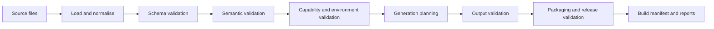
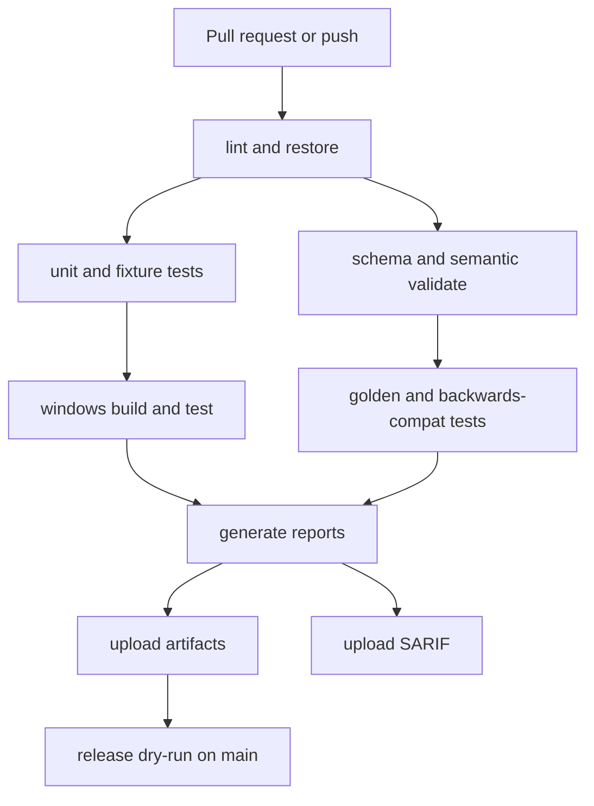

# WastelandForge Validation Testing CI Release and Governance

## Executive summary

This report treats **R008** as the operating model for how WastelandForge proves correctness, protects stability, ships releases, and accepts contributions. The central recommendation is a **layered validation-first platform**: canonical source contracts are validated in progressively stricter stages, tests are organised by risk and portability, CI is GitHub Actions–first with a **mandatory Windows lane**, release artefacts carry a local build manifest plus optional standards-aligned provenance, and governance is deliberately **offline-first and AI-optional**. That model fits the project’s earlier architectural direction: Forge owns intent, validation, and generation; external tools remain providers, not hidden assumptions. citeturn42view0turn33view0turn32view0turn24view2

The strongest external constraints are now clear. GitHub-hosted runners are fresh VMs for each job, while self-hosted runners give more control but are not guaranteed clean between jobs; that pushes WastelandForge toward GitHub-hosted Windows for normal CI and reserved self-hosted Windows only for later, heavyweight integration tests. GitHub’s branch protection and rulesets can require pull requests, status checks, code-owner approvals, signed commits, and more; rulesets layer more cleanly than classic branch protection rules, so they should be the default governance mechanism for a new repository. GitHub code scanning can ingest third-party **SARIF 2.1.0** results, but public repositories have the simplest path, while private organisation repositories need GitHub Code Security enabled; therefore SARIF generation must be **local and canonical**, with GitHub upload treated as an optional publishing surface rather than a required correctness path. citeturn34view0turn28view0turn40view0turn22view0turn40view1turn42view0turn44view1

The key architectural decision for R008 should therefore be:

**ADR-011 — Validation and Release Governance Model**

**Decision:** WastelandForge uses a layered validation system, deterministic fixture-backed testing, GitHub Actions–based CI centred on Windows and .NET, immutable published schemas, SemVer-governed version streams, a mandatory local build-manifest, optional SLSA-style release provenance, least-privilege repository governance, and contribution rules that do not require AI.

In practice, the MVP should build only a small but defensible spine: `forge validate`, schema and semantic validators, issue JSON, SARIF export, TRX-native test output, Windows CI, build-manifest generation, dependency review, CODEOWNERS, SECURITY.md, and a release dry-run. Everything else can layer on top. citeturn21view1turn38view1turn38view2turn29view2turn33view1

## Assumptions and design constraints

Two assumptions materially affect the recommendations. First, the project brief does not specify a .NET target. As of **9 June 2026**, Microsoft lists **.NET 8** and **.NET 9** as supported until **10 November 2026**, while **.NET 10 LTS** is already active until **14 November 2028**. If WastelandForge must choose only between 8 and 9 for an immediate MVP, **.NET 8** is the safer baseline because it is an LTS release rather than STS; however, because both 8 and 9 end support in the same November 2026 window, implementation planning should include an early path to .NET 10. citeturn29view0turn29view1turn29view2turn29view3

Second, the brief does not specify the legal status of redistributing Fallout: New Vegas assets. This report therefore assumes a conservative posture: **do not redistribute Bethesda-owned game assets in the public test corpus unless explicit permission exists**. That drives the recommended fixture strategy toward synthetic registries, synthetic plugins, tiny handcrafted binary fixtures, hashes, and “bring-your-own-install” local extended tests.

Two non-negotiable project constraints also shape the design. **Offline-first** means validation, generation, schema resolution, test execution, and basic packaging must work without network access. **AI-optional** means no required API keys, no cloud model calls in the correctness path, and no governance rule that penalises contributors who do not use AI. Those are platform rules, not implementation details.

## Validation and testing architecture

Validation should be modelled as **staged narrowing**, not a single pass. JSON Schema 2020-12 is expressly intended for validation and documentation, and its annotation keywords such as `title`, `description`, `default`, `deprecated`, and `examples` are useful for both docs and diagnostics. JSON Schema guidance strongly recommends an explicit absolute `$id` for each schema, and also warns that `$id` values are identifiers, not a guarantee that implementations should make remote network requests. That combination strongly supports a WastelandForge design where schema IDs are stable and public, but the resolver is local-cache-first and can run entirely offline. citeturn30view0turn30view1turn30view2turn30view3turn24view2turn24view3

Recommended validation pipeline:



This produces clear rule families with stable prefixes:

| Rule family | What it covers | Blocks release |
|---|---|---|
| `WF-LOAD-*` | file discovery, parse, encoding, duplicate file IDs | yes |
| `WF-SCHEMA-*` | JSON Schema shape, unsupported schema version, missing `$schema`/`$id` | yes |
| `WF-SEM-*` | cross-registry references, ownership, uniqueness, semantic invariants | yes |
| `WF-CAP-*` | provider/capability resolution, wrong scope, unsupported versions | sometimes |
| `WF-ASSET-*` | path validity, missing files, case/path normalisation, manifest drift | sometimes |
| `WF-GEN-*` | generator input/output checks, stale outputs, provenance gaps | yes for required outputs |
| `WF-BUILD-*` | build graph, cache state, incremental rebuild correctness | yes |
| `WF-REL-*` | package completeness, changelog/version/tag consistency, schema publication gates | yes |
| `WF-GOV-*` | missing CODEOWNERS, SECURITY.md, templates, policy documents | yes on protected branches |
| `WF-SEC-*` | unsafe secrets use, forbidden dependencies, unpinned third-party actions | yes |

The most important design choice is that **schema validation is not enough**. WastelandForge needs semantic validators that understand registry meaning, capability validators that understand the surrounding toolchain, and release validators that inspect whether the package is shippable rather than merely well-formed.

A practical diagnostic model should stay canonical as JSON and map outward to console, SARIF, Markdown, and GitHub annotations. SARIF is especially useful because GitHub code scanning accepts third-party SARIF uploads, requires the `upload-sarif` action, supports categorisation for multiple analyses on the same commit, and only supports **SARIF 2.1.0**. citeturn42view0turn42view2turn42view3turn44view1

Example canonical issue object:

```json
{
  "ruleId": "WF-SEM-014",
  "severity": "error",
  "category": "semantic",
  "title": "Unknown capability reference",
  "message": "Dependency registry references capability 'runtime.ui.fake_provider' which is not defined.",
  "projectId": "io.github.theboyyss.examplemod",
  "primaryLocation": {
    "file": "registries/dependencies/main.yaml",
    "pointer": "/requires/capabilities/2/id",
    "line": 19,
    "column": 11
  },
  "relatedLocations": [
    {
      "file": "registries/capabilities/runtime.yaml",
      "pointer": "/capabilities"
    }
  ],
  "suggestedFix": "Declare the capability in the capability registry or remove the dependency.",
  "docsUri": "https://docs.wastelandforge.dev/rules/WF-SEM-014",
  "fingerprint": "wf:sem:014:runtime.ui.fake_provider"
}
```

Example SARIF emission derived from the canonical issue model. GitHub’s code scanning support expects SARIF 2.1.0 and uses `tool.driver`, `results`, and location data; categories should differentiate multiple analyses for one commit. citeturn44view1turn42view3

```json
{
  "$schema": "https://json.schemastore.org/sarif-2.1.0.json",
  "version": "2.1.0",
  "runs": [
    {
      "tool": {
        "driver": {
          "name": "WastelandForge",
          "semanticVersion": "0.1.0",
          "rules": [
            {
              "id": "WF-SEM-014",
              "shortDescription": { "text": "Unknown capability reference" }
            }
          ]
        }
      },
      "results": [
        {
          "ruleId": "WF-SEM-014",
          "level": "error",
          "message": {
            "text": "Dependency registry references capability 'runtime.ui.fake_provider' which is not defined."
          },
          "locations": [
            {
              "physicalLocation": {
                "artifactLocation": {
                  "uri": "registries/dependencies/main.yaml"
                },
                "region": {
                  "startLine": 19,
                  "startColumn": 11
                }
              }
            }
          ],
          "partialFingerprints": {
            "primaryLocationLineHash": "wf-sem-014-19"
          }
        }
      ]
    }
  ]
}
```

The test taxonomy should be explicit and tied to risk:

| Test type | Purpose | CI lane | Recommendation |
|---|---|---|---|
| Unit | pure library logic, parsers, ID rules, path helpers | all PRs | mandatory |
| Schema | validate example docs against published schemas | all PRs | mandatory |
| Semantic | cross-registry invariants and diagnostics | all PRs | mandatory |
| Golden | snapshot of generated docs, manifests, diagnostics, SARIF | PRs | mandatory for stable generators |
| Fixture | realistic mini-projects and broken-project cases | PRs | mandatory |
| Windows | path semantics, file locking, packaging, CLI UX | PRs and main | mandatory |
| Backwards-compatibility | old registry/schema versions still load or migrate | main and release | mandatory |
| Extended integration | provider/toolchain tests needing local installs | nightly/self-hosted | defer to later |

For results formats, the cleanest rule is: **JSON is canonical, SARIF is the diagnostics exchange format, TRX is the native .NET test record, and JUnit is a derived compatibility format**. The relevant .NET documentation highlights VSTest/MTP and **TRX/report-trx** paths rather than JUnit; that is why JUnit should be emitted only as a compatibility artefact where needed, not treated as the source of truth. citeturn27view1turn27view2

Fixture strategy should follow a “redistributable first” rule:

- **Public fixtures**: synthetic YAML/JSON registries, synthetic asset paths, tiny handcrafted binary plugins or record fragments with no shipped game content, golden docs, SARIF, build manifests, and failure cases.
- **Reference fixtures**: hashes, expected metadata, and synthetic stand-ins for ecosystem providers.
- **Private extended fixtures**: user-supplied real installs or mods, excluded from public CI and run only locally or on controlled self-hosted infrastructure.

That split keeps the public repository legally safer and still lets the platform exercise real-world semantics.

## CI and repository workflow

GitHub Actions is the right default CI substrate because it provides hosted runners across Windows, Ubuntu, and macOS, workflow artefacts, code scanning upload, and later artifact attestations. GitHub-hosted runners are fresh VMs for each job, which is excellent for repeatability; self-hosted runners offer more control and can keep large local tool stacks or game installs, but they are not guaranteed clean between jobs and shift operational burden to the project. citeturn34view0turn28view0

Runner choice for WastelandForge should therefore look like this:

| Runner choice | Use it for | Why |
|---|---|---|
| GitHub-hosted Windows | CLI builds, tests, path/casing validation, packaging, ZIP/FOMOD shaping | closest to real mod-author environment; fresh VM per job citeturn34view0 |
| GitHub-hosted Ubuntu | fast lint, unit, schema, semantic, docs, SARIF export | cheap and fast baseline CI citeturn34view0 |
| GitHub-hosted macOS | optional later cross-platform CLI confidence | lower priority for FNV use case citeturn34view0 |
| Self-hosted Windows | nightly provider/integration tests with installed tools/game | only when you truly need local software control; maintain carefully citeturn28view0 |

Recommended CI jobs:



The baseline pipeline should produce these artefacts on every important run:

- console log summary
- canonical issue JSON
- SARIF diagnostics
- TRX test results
- optional derived JUnit
- generated docs diff or golden diff
- build-manifest JSON
- packaged dry-run zip/folder on main and release branches

GitHub’s artefact model fits this well: artefacts persist data after a job completes and can be shared with later jobs in the same workflow. The official `upload-artifact` action is now on **v4**; the upstream repository notes that `v3` was scheduled for deprecation, so new workflows should target v4 or later. citeturn33view0turn33view2

For .NET setup, the official `actions/setup-dotnet` repository currently documents **`actions/setup-dotnet@v5`**, supports version pinning as well as `LTS`/`STS` channels, and warns that hosted runner preinstalled SDKs can change. That means WastelandForge should use an explicit SDK version via `global.json` and install it in CI rather than trusting whatever happens to be preinstalled. citeturn25view0

Sample GitHub Actions workflow. For readability this example uses major tags, but **production workflows should pin third-party actions to full commit SHAs**, because GitHub documents full-length commit SHAs as the only immutable form for action references. citeturn38view1turn38view2

```yaml
name: ci

on:
  pull_request:
  push:
    branches: [main, release/*]

permissions:
  contents: read

jobs:
  validate:
    name: validate-ubuntu
    runs-on: ubuntu-latest
    permissions:
      contents: read
      security-events: write
      actions: read
    steps:
      - name: Checkout
        uses: actions/checkout@v6

      - name: Setup .NET
        uses: actions/setup-dotnet@v5
        with:
          dotnet-version: 8.0.x

      - name: Restore
        run: dotnet restore WastelandForge.sln

      - name: Build
        run: dotnet build WastelandForge.sln -c Release --no-restore

      - name: Validate fixtures and schemas
        run: dotnet test tests/WastelandForge.Tests/WastelandForge.Tests.csproj -c Release --no-build --logger "trx;LogFileName=validation.trx"

      - name: Forge validate
        run: dotnet run --project src/WastelandForge.Cli -- validate fixtures/projects/ExampleMod --format sarif --out artifacts/sarif/wf.sarif

      - name: Upload SARIF
        uses: github/codeql-action/upload-sarif@v4
        with:
          sarif_file: artifacts/sarif/wf.sarif
          category: forge-validation

      - name: Upload artifacts
        uses: actions/upload-artifact@v4
        with:
          name: ubuntu-validation-artifacts
          path: |
            artifacts/**/*.json
            artifacts/**/*.sarif
            **/*.trx

  windows:
    name: build-test-windows
    runs-on: windows-latest
    permissions:
      contents: read
    steps:
      - name: Checkout
        uses: actions/checkout@v6

      - name: Setup .NET
        uses: actions/setup-dotnet@v5
        with:
          dotnet-version: 8.0.x

      - name: Restore
        run: dotnet restore WastelandForge.sln

      - name: Build
        run: dotnet build WastelandForge.sln -c Release --no-restore

      - name: Run Windows-sensitive tests
        run: dotnet test tests/WastelandForge.WindowsTests/WastelandForge.WindowsTests.csproj -c Release --no-build --logger "trx;LogFileName=windows.trx"

      - name: Dry-run build
        run: dotnet run --project src/WastelandForge.Cli -- build fixtures/projects/ExampleMod --configuration Release --output artifacts/build

      - name: Upload Windows artifacts
        uses: actions/upload-artifact@v4
        with:
          name: windows-build-artifacts
          path: |
            artifacts/build/**
            **/*.trx
```

Repository protection should use **rulesets** rather than only legacy branch protection where possible. GitHub notes that only one classic branch protection rule can apply at a time, while rulesets layer alongside existing rules and can enforce pull requests, status checks, linear history, signed commits, code scanning results, and more. Required status checks must end in `successful`, `skipped`, or `neutral`, and GitHub explicitly warns that required job names must be unique across workflows to avoid ambiguous merge blocking. citeturn22view0turn40view0turn40view1

Recommended repository governance baseline:

- `main` and `release/*` protected by rulesets
- required pull request before merge
- required status checks: `validate-ubuntu`, `build-test-windows`, `release-dry-run` on relevant branches
- at least one human approval; two for release changes and schema changes
- required code-owner review for `schemas/**`, `src/WastelandForge.Validation/**`, `.github/**`, and release metadata
- optional signed commits for MVP, required on release branches later
- no bypass except maintainers and release GitHub App, if any

A `CODEOWNERS` file belongs most naturally at `.github/CODEOWNERS`; GitHub will also honour a root or `docs/` location, but it searches in that order and uses the first file it finds. Code owners are auto-requested on PRs that touch owned paths, and branch protection can require code-owner approval. citeturn39view0turn39view1turn22view0

## Schema publication versioning and provenance

Schema publication needs a stricter policy than normal docs, because schema URLs become part of the public API. JSON Schema recommends absolute `$id` values and treats them as identifiers; if WastelandForge chooses HTTP URLs for `$id`, those URLs should be stable, published, and never silently rewritten. Since schema IDs do not force network resolution, Forge should cache released schemas locally and validate offline by default. citeturn24view2turn24view3

Recommended schema hosting options:

| Option | Strengths | Weaknesses | Recommendation |
|---|---|---|---|
| GitHub Pages with custom domain | simple static hosting; can publish from branch/folder or workflow; natural fit for schema docs and raw JSON | published content is public; needs immutability discipline | **recommended** for public schemas citeturn23view0turn23view1 |
| Non-resolving URN/Tag URI only | strongest offline semantics | poor discoverability and worse docs UX | acceptable only for internal/private experiments citeturn24view2turn24view3 |
| Repository blobs only | easy to start | no clean immutable public contract story | not recommended as long-term public API |

Immutability policy:

- every released schema file includes `$schema` and absolute `$id`
- once a schema URL is published, its content is immutable
- breaking changes get a new major path
- old schemas remain available indefinitely
- deprecation happens through docs and annotations, not content replacement
- local Forge releases ship a schema cache so network access is never required for normal validation

Version streams should be separated:

| Stream | Versioning policy | Notes |
|---|---|---|
| CLI / core packages | SemVer | breaking command/API changes require major bump |
| Schemas | SemVer with immutable published URLs | major bump for incompatible shape/meaning change |
| Provider catalog | SemVer | additive capability defs in minor; breaking detector semantics in major |
| Generators | SemVer per generator package | recorded in build-manifest and provenance |
| Rule packs | SemVer | new warnings can be minor; changed error semantics should be major or feature-flagged |

For provenance, use two layers. First, a **mandatory local `build-manifest.json`** written by Forge itself on every build. Second, for CI releases, an **optional external attestation**. GitHub documents artifact attestations as cryptographically signed provenance claims that can include the workflow link, repository, organisation, environment, commit SHA, triggering event, and other OIDC-derived context; GitHub also documents offline verification of attestations with `gh attestation`, trusted roots, and no internet connection during verification itself. SLSA v1.2’s build provenance model provides a good conceptual template: `subject`, `predicateType`, `buildDefinition`, `runDetails`, builder identity, timestamps, and resolved dependencies. citeturn33view0turn33view1turn31view0turn32view0

Example local build manifest:

```json
{
  "forgeVersion": "0.1.0",
  "projectId": "io.github.theboyyss.examplemod",
  "buildId": "2026-06-09T12:00:00Z",
  "gitCommit": "abc123def456",
  "schemaVersions": {
    "manifest": "0.1.0",
    "dependencyRegistry": "0.1.0",
    "capabilityRegistry": "0.1.0"
  },
  "generatorVersions": {
    "wf.generator.docs": "0.1.0",
    "wf.generator.package": "0.1.0"
  },
  "capabilityResolution": {
    "runtime.scripting.xnvse": "not-required",
    "tool.xedit": "not-detected"
  },
  "sourceDigest": {
    "sha256": "..."
  },
  "outputs": [
    {
      "path": "dist/ExampleMod-0.1.0.zip",
      "mediaType": "application/zip",
      "sha256": "..."
    }
  ]
}
```

Example provenance sidecar for a binary or package artefact, inspired by SLSA’s separation of subject, build definition, and run details. citeturn32view0

```json
{
  "subject": {
    "name": "ExampleMod-0.1.0.zip",
    "sha256": "..."
  },
  "buildDefinition": {
    "buildType": "wastelandforge/package/v1",
    "externalParameters": {
      "projectId": "io.github.theboyyss.examplemod",
      "configuration": "Release"
    },
    "resolvedDependencies": [
      { "uri": "git+repo", "digest": { "gitCommit": "abc123def456" } }
    ]
  },
  "runDetails": {
    "builder": {
      "id": "wastelandforge-cli-local"
    },
    "metadata": {
      "invocationId": "build-2026-06-09T12:00:00Z",
      "startedOn": "2026-06-09T12:00:00Z",
      "finishedOn": "2026-06-09T12:00:04Z"
    }
  }
}
```

Release workflow should stay simple:

- pull request into `main`
- merge after required checks
- `main` produces release dry-run package and published preview docs
- tag `vX.Y.Z` from a reviewed release PR
- tag workflow rebuilds from source, writes build-manifest, publishes package, uploads artefacts, and optionally emits GitHub attestation
- published release notes are generated deterministically first, then lightly edited by humans

## Governance security and dependency policy

GitHub’s secure-use guidance is unusually clear here: third-party actions are a meaningful risk surface, the recommended mitigation is to **pin actions to a full-length commit SHA**, and `GITHUB_TOKEN` should be granted minimum required permissions, ideally read-only by default with explicit escalation per job. GitHub also warns against storing structured secret blobs as a single secret and recommends masking and rotating exposed values. Dependabot alerts help identify vulnerable dependencies, and GitHub recommends a `SECURITY.md` policy to explain supported versions and vulnerability reporting. citeturn38view1turn38view2turn38view3turn19view3turn21view1turn21view2

Recommended dependency governance policy:

**Allowed by default**
- Microsoft and .NET ecosystem libraries with active maintenance
- permissive open-source dependencies in core paths
- official GitHub Actions and first-party tooling
- optional provider integrations that remain non-canonical

**Allowed with explicit review**
- MPL/LGPL-style copyleft in isolated tooling layers
- external CLIs invoked as optional providers
- test-only converters and loggers, including JUnit adapters
- self-hosted CI infrastructure components

**Forbidden in core**
- proprietary or paid SaaS requirements for normal operation
- dependencies that require cloud connectivity for validation/build correctness
- telemetry/analytics SDKs enabled by default
- unreviewed native binaries or opaque auto-updaters
- unpinned third-party GitHub Actions in protected workflows
- dependencies whose licence terms would likely infect or materially constrain downstream mod authors without an intentional project decision

Security policy should include:

- `SECURITY.md` with supported branches/versions and private reporting channel
- least-privilege workflow permissions
- action pinning by full SHA on protected branches
- Dependabot enabled for NuGet and GitHub Actions
- secret scanning and dependency review where repository plan allows
- no secrets in public fixture data
- no credentials in golden outputs or provenance files
- release artefacts reproducible from reviewed tags

Telemetry and privacy policy should be extremely strict for a modding platform:

- **no telemetry by default**
- no network egress for `forge validate`, `forge build`, `forge test`, `forge docs`, or schema resolution
- optional telemetry, if ever added, must be explicit opt-in, documented, local-buffer-first, and easy to disable
- AI features, if any, must be in separate packages or commands and must never alter canonical project state without a human-reviewed commit

Contribution policy should formalise the AI-optional rule:

- contributors are never required to use AI
- AI-generated text/code is allowed only if the submitter accepts responsibility for it
- PR template should ask whether AI materially assisted the change
- schema, diagnostics, governance, and release logic always need human review
- generated files should not be edited directly unless the project explicitly designates them as hand-editable
- golden updates require reviewers to inspect meaningful diff, not merely re-run tooling

## MVP slice ADR recommendation and open questions

A concrete v0.1 repository shape should privilege simplicity and audibility:

```text
/
├─ .github/
│  ├─ workflows/
│  │  ├─ ci.yml
│  │  ├─ release.yml
│  │  └─ schema-publish.yml
│  ├─ CODEOWNERS
│  ├─ PULL_REQUEST_TEMPLATE.md
│  ├─ ISSUE_TEMPLATE/
│  └─ dependabot.yml
├─ docs/
│  ├─ rules/
│  ├─ schemas/
│  └─ governance/
├─ eng/
│  ├─ versions.props
│  └─ Directory.Build.props
├─ schemas/
│  ├─ manifest/
│  ├─ dependencies/
│  ├─ capabilities/
│  └─ assets/
├─ src/
│  ├─ WastelandForge.Core/
│  ├─ WastelandForge.Schema/
│  ├─ WastelandForge.Registry/
│  ├─ WastelandForge.Validation/
│  ├─ WastelandForge.Generation/
│  ├─ WastelandForge.Provenance/
│  └─ WastelandForge.Cli/
├─ tests/
│  ├─ WastelandForge.UnitTests/
│  ├─ WastelandForge.SchemaTests/
│  ├─ WastelandForge.SemanticTests/
│  ├─ WastelandForge.GoldenTests/
│  ├─ WastelandForge.WindowsTests/
│  └─ WastelandForge.BackCompatTests/
├─ fixtures/
│  ├─ projects/
│  │  ├─ ExampleMod/
│  │  └─ BrokenCases/
│  ├─ golden/
│  ├─ sarif/
│  ├─ manifests/
│  └─ synthetic-plugins/
├─ SECURITY.md
├─ CONTRIBUTING.md
├─ README.md
├─ global.json
└─ WastelandForge.sln
```

MVP implementation slice:

- canonical issue model and severity mapping
- schema loader and offline resolver
- `forge validate` with `json`, `sarif`, and human console output
- semantic validators for manifest, dependency, capability, and asset registries
- fixture harness and golden update flow
- Windows-sensitive tests in CI
- build-manifest writer
- release dry-run packaging
- CODEOWNERS, SECURITY.md, branch/ruleset baseline

Example `forge validate` output:

```text
WastelandForge Validation Report
Project: io.github.theboyyss.examplemod
Forge:   0.1.0

Load
  OK   manifest loaded
  OK   dependency registry loaded
  OK   capability registry loaded

Schema
  OK   all documents matched supported schemas

Semantic
  OK   project id valid
  OK   registry ownership graph valid
  ERR  WF-SEM-014 unknown capability reference
       registries/dependencies/main.yaml:19:11
       runtime.ui.fake_provider is not defined

Capabilities
  WARN WF-CAP-002 optional capability not detected
       runtime.ui.mcm_extender

Result
  1 error
  1 warning
  exit code: 1
```

Example `forge build` output:

```text
WastelandForge Build
Project: io.github.theboyyss.examplemod
Configuration: Release

Validate
  OK   schema validation
  OK   semantic validation
  OK   capability resolution (required capabilities satisfied)
  WARN optional capability runtime.ui.mcm_extender not detected

Generate
  OK   docs generated
  OK   dependency report generated
  SKIP generated MCM JSON (optional capability unavailable)

Package
  OK   staging completed
  OK   build-manifest.json written
  OK   dist/ExampleMod-0.1.0.zip created

Result
  0 errors
  1 warning
```

### ADR recommendation

**ADR-011 — Validation and Release Governance Model**

**Decision**

WastelandForge should adopt a **layered validation and governance architecture** with:

- canonical JSON issue model
- staged validation from load → schema → semantic → capability → output → release
- deterministic, redistributable fixtures as the public test backbone
- GitHub Actions as the default CI system, with mandatory Windows coverage
- immutable published schemas with absolute `$id` values and local offline resolution
- separate SemVer streams for CLI, schemas, provider catalogues, and generators
- mandatory local build-manifest generation
- optional GitHub artifact attestations / SLSA-aligned provenance for releases
- strict dependency governance, least-privilege CI permissions, and no required cloud services
- no required AI in contribution, build, validation, or release flows

**Why**

This is the smallest model that still gives WastelandForge defensible correctness, reproducibility, supply-chain hygiene, and contributor trust, while staying aligned with the project’s offline-first and ecosystem-orchestrating goals. citeturn24view2turn33view0turn33view1turn38view1turn42view0

### MVP checklist

- [ ] `global.json` committed and CI-pinned SDK chosen
- [ ] `.github/CODEOWNERS` committed
- [ ] `SECURITY.md` committed
- [ ] rulesets configured for `main` and `release/*`
- [ ] canonical issue model implemented
- [ ] JSON Schema validation working offline
- [ ] first semantic validators implemented
- [ ] SARIF 2.1.0 export implemented
- [ ] TRX test output in CI
- [ ] Windows job required in PR checks
- [ ] public redistributable fixtures created
- [ ] build-manifest.json emitted by `forge build`
- [ ] release dry-run workflow active
- [ ] dependency governance document committed
- [ ] PR template includes AI-assist disclosure field

### Open questions and limitations

The highest-value unresolved points are not conceptual; they are scope decisions:

- whether v0.1 should target **.NET 8** for immediate stability or move directly to **.NET 10 LTS** now that it is current
- whether JUnit output is worth carrying in core, or should remain a derived plug-in/output adapter
- how much of release packaging beyond ZIP should enter v0.1, especially FOMOD generation
- whether GitHub code scanning upload should be enabled by default in public repos or left as an opt-in workflow
- how far to take signed-commit / signed-tag enforcement before contributor friction outweighs value
- whether any public synthetic plugin fixture format should eventually become a tiny documented standard for community test packs

The one material legal assumption in this report is the conservative stance against redistributing game assets in the public fixture corpus. If that assumption changes, the fixture strategy could widen substantially.